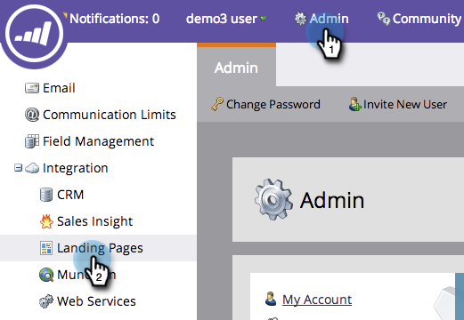
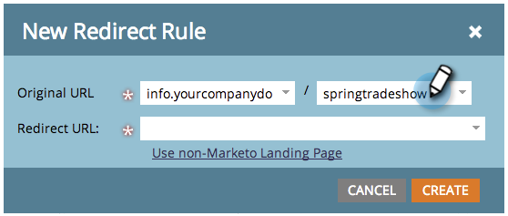
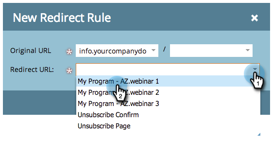

# Reindirizzare una pagina di destinazione Marketo a un’altra pagina {#redirect-a-marketo-landing-page-to-another-page}

Se mai aggiorni l’URL di una pagina e vuoi che il vecchio URL funzioni ancora, prova a effettuare un reindirizzamento. La configurazione è semplice.

>[!NOTE]
>
>**Autorizzazioni amministratore richieste**

1. In **[!UICONTROL Admin]**, fare clic su **[!UICONTROL Landing Pages]**.

   

1. Nella scheda **[!UICONTROL Rules]** fare clic su **[!UICONTROL New]** e quindi su **[!UICONTROL New Redirect Rule]**.

   

1. Fai clic sul primo elenco a discesa **[!UICONTROL Original URL]** e seleziona il tuo Marketo [CNAME](/help/marketo/product-docs/demand-generation/landing-pages/landing-page-actions/customize-your-landing-page-urls-with-a-cname.md).

   

   >[!NOTE]
   >
   >Ricorda che puoi reindirizzare solo gli URL che iniziano con il tuo Marketo [CNAME](/help/marketo/product-docs/demand-generation/landing-pages/landing-page-actions/customize-your-landing-page-urls-with-a-cname.md).

1. Scegliere la pagina di destinazione da reindirizzare nel secondo campo **[!UICONTROL Original URL]**.

   

   >[!NOTE]
   >
   >Puoi immettere qualsiasi percorso URL, anche se la pagina o la directory non esiste.

1. Fai clic sul menu a discesa **[!UICONTROL Redirect URL]** e seleziona la pagina a cui desideri reindirizzare i visitatori.

   

1. Fai clic su **[!UICONTROL Create]**.

   

   >[!TIP]
   >
   >Per reindirizzare a una pagina Web esterna a Marketo, fare clic su **[!UICONTROL Use non-Marketo Landing Page]**.

   >[!MORELIKETHIS]
   >
   >[Reindirizzare un percorso URL](/help/marketo/product-docs/demand-generation/landing-pages/personalizing-landing-pages/redirect-a-url-path.md)
