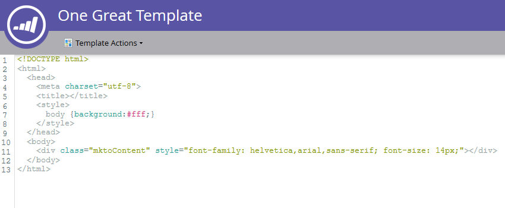

# Creare un modello di pagina di destinazione in formato libero {#create-a-free-form-landing-page-template}

Le pagine di destinazione in formato libero richiedono meno conoscenze tecniche delle relative controparti guidate. Per creare un modello per le pagine di destinazione future, segui i passaggi indicati di seguito.

1. Passa a **[!UICONTROL Design Studio]**.

   

1. Fai clic su **[!UICONTROL New]**, quindi seleziona **[!UICONTROL New Landing Page Template]**.

   

1. Scegli la cartella, quindi assegna un nome al modello. Il formato libero è la modalità di modifica predefinita. Dopo aver denominato il modello, fare clic su **[!UICONTROL Create]**.

   

1. Il modello dovrebbe essere aperto in una nuova scheda. Ora è modificabile da chiunque abbia familiarità con CSS/HTML.

   

   >[!NOTE]
   >
   >Il supporto Marketo non è configurato per assistere nella risoluzione dei problemi di HTML personalizzato. Per assistenza su HTML, consulta uno sviluppatore web.

1. Al termine delle modifiche, fare clic su **[!UICONTROL Template Actions]**, quindi selezionare **[!UICONTROL Approve and Close]**.

   

   >[!NOTE]
   >
   >Selezionare **[!UICONTROL Disable Munchkin Tracking]** se si desidera evitare che i moduli vengano precompilati oppure non si desidera tenere traccia del comportamento Web in una pagina specifica.
   >Selezionare **[!UICONTROL Validate Mobile Compatibility]** per verificare che il codice sia compatibile con i dispositivi mobili.

   >[!MORELIKETHIS]
   >
   >* [Crea una pagina di destinazione in formato libero](/help/marketo/product-docs/demand-generation/landing-pages/free-form-landing-pages/create-a-free-form-landing-page.md)
   >* [Creare un modello di pagina di destinazione guidata](/help/marketo/product-docs/demand-generation/landing-pages/landing-page-templates/create-a-guided-landing-page-template.md)
   >* [Informazioni sulle pagine di destinazione in formato libero e guidato](/help/marketo/product-docs/demand-generation/landing-pages/understanding-landing-pages/understanding-free-form-vs-guided-landing-pages.md)
