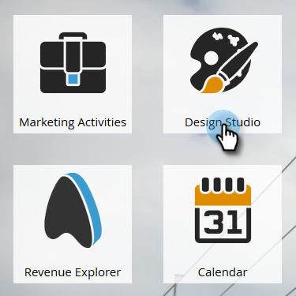

# Creare un modello di pagina di destinazione a forma libera {#create-a-free-form-landing-page-template}

Le pagine di destinazione a forma libera richiedono meno conoscenze tecniche rispetto alle controparti guidate. Per creare un modello per le pagine di destinazione future, attenetevi alla procedura riportata di seguito.

1. Andate a **Design Studio**.

   

1. Fate clic su **Nuovo**, quindi selezionate **Nuovo modello** pagina di destinazione.

   

1. Scegliete la cartella, quindi assegnate un nome al modello. Il modulo gratuito è la modalità di modifica predefinita; quindi, dopo aver assegnato un nome al modello, fate clic su **Crea**.

   

1. Il modello deve essere aperto in una nuova scheda. È ora modificabile per chiunque abbia familiarità con CSS/HTML.

   

   >[!NOTE]
   >
   >Il supporto di Marketo non è impostato per fornire assistenza nella risoluzione di problemi HTML personalizzati. Per assistenza HTML, consultate uno sviluppatore Web.

1. Dopo aver apportato le modifiche, fai clic su Azioni **** modello, quindi seleziona **Approva e Chiudi**.

   

   Ora è disponibile un nuovo modello per pagina di destinazione a forma libera.

   >[!NOTE]
   >
   >Selezionare **Disattiva tracciamento** Munchkin se si desidera impedire la precompilazione dei moduli, oppure se non si desidera tenere traccia del comportamento Web in una pagina specifica.\
   >Selezionate **Convalida compatibilità** mobile per assicurarvi che il codice sia compatibile con i dispositivi mobili.

   >[!NOTE]
   >
   >**Articoli correlati**
   >
   >    
   >    
   >    * [Creare una pagina di destinazione a forma libera](../../../../product-docs/demand-generation/landing-pages/free-form-landing-pages/create-a-free-form-landing-page.md)
   >    * [Creare un modello di pagina di destinazione guidato](create-a-guided-landing-page-template.md)
   >    * [Informazioni sulle pagine di destinazione a forma libera e guidate](../../../../product-docs/demand-generation/landing-pages/understanding-landing-pages/understanding-free-form-vs-guided-landing-pages.md)

