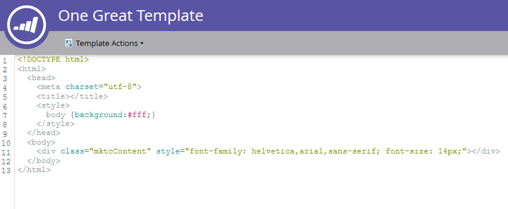

# Creare un modello di pagina di destinazione in formato libero {#create-a-free-form-landing-page-template}

Le pagine di destinazione in formato libero richiedono meno conoscenze tecniche delle relative controparti guidate. Per creare un modello per le pagine di destinazione future, segui i passaggi indicati di seguito.

1. Vai a **Design Studio**.

   

1. Clic **Nuovo**, quindi seleziona **Nuovo modello per pagina di destinazione**.

   

1. Scegli la cartella, quindi assegna un nome al modello. Il formato libero è la modalità di modifica predefinita, quindi dopo aver denominato il modello, fai clic su **Crea**.

   

1. Il modello dovrebbe essere aperto in una nuova scheda. Ora è modificabile da chiunque abbia familiarità con CSS/HTML.

   

   >[!NOTE]
   >
   >Il supporto Marketo non è configurato per fornire assistenza nella risoluzione dei problemi di custom HTML. Per assistenza HTML, consulta uno sviluppatore web.

1. Al termine delle modifiche, fai clic su **Azioni modello**, quindi seleziona **Approva e chiudi**.

   

   Ora disponi di un nuovo modello di pagina di destinazione in formato libero.

   >[!NOTE]
   >
   >Seleziona **Disabilita tracciamento Munchkin** se si desidera impedire la precompilazione dei moduli o semplicemente non tenere traccia del comportamento web su una pagina specifica.\
   >Seleziona **Convalida compatibilità mobile** per verificare che il codice sia compatibile con i dispositivi mobili.

   >[!MORELIKETHIS]
   >
   >* [Creare una pagina di destinazione in formato libero](/help/marketo/product-docs/demand-generation/landing-pages/free-form-landing-pages/create-a-free-form-landing-page.md)
   >* [Creare un modello di pagina di destinazione guidata](/help/marketo/product-docs/demand-generation/landing-pages/landing-page-templates/create-a-guided-landing-page-template.md)
   >* [Informazioni sulle pagine di destinazione in formato libero e guidato](/help/marketo/product-docs/demand-generation/landing-pages/understanding-landing-pages/understanding-free-form-vs-guided-landing-pages.md)
