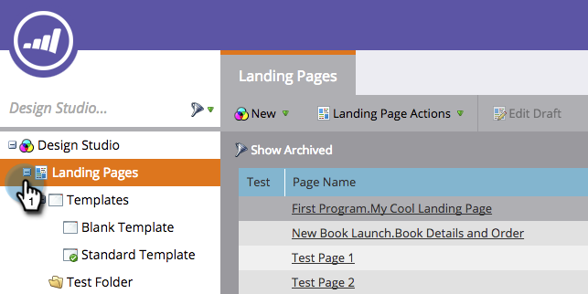

# Modifica di un modello di pagina di destinazione Marketo {#edit-a-marketo-landing-page-template}

Puoi modificare qualsiasi modello di pagina di destinazione in Marketo.

1. Andate a **Design Studio**.

   

1. Espandete Pagine **di** destinazione per mostrare i modelli.

   

1. Selezionate il **modello** da modificare. Fare clic su** Modifica bozza*.

   

   Fatto! Ora potete modificare il CSS del modello e controllarne completamente l’aspetto e il layout.

   >[!NOTE]
   >
   >Quando modificate un modello di pagina di destinazione, verrà creata una bozza di qualsiasi risorsa della pagina di destinazione utilizzando tale modello.

