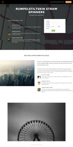

# Elenco modelli pagina di destinazione guidata {#guided-landing-page-template-list}

Sfoglia la nostra raccolta di modelli di esempio, da utilizzare con [Editor pagina di destinazione guidato](/help/marketo/product-docs/demand-generation/landing-pages/guided-landing-pages/create-a-guided-landing-page.md). Ogni modello è completamente reattivo e basato sul framework Bootstrap.

>[!NOTE]
>
>Il supporto Marketo non è configurato per fornire assistenza nella risoluzione dei problemi di HTML. Se hai bisogno di assistenza per modificare uno di questi modelli, consulta uno sviluppatore web.

Per importare un modello in Marketo:

1. Fai clic sul nome del modello per ingrandire la visualizzazione.
1. Scarica il modello scelto.
1. In Marketo, passa a **Design Studio.**
1. Fai clic su **Pagine di destinazione** nella struttura a sinistra, quindi seleziona **Modelli.**

1. Nella barra dei menu, fai clic su **Importa modello.**
1. Scegli il file scaricato, inserisci un nome di modello, quindi fai clic su **Importa** (assicurati di scegliere un nome descrittivo e indica che la modalità di modifica è **Guidata**).

|  |  |  |
|---|---|---|
| [Modello 1A](guided-landing-page-templates/template-1a.md) | [Modello 1B](guided-landing-page-templates/template-1b.md) | [Modello 1C](guided-landing-page-templates/template-1c.md) |
|  |  |  |
| [Modello 1D](guided-landing-page-templates/template-1d.md) | [Modello 1E](guided-landing-page-templates/template-1e.md) | [Modello 1F](guided-landing-page-templates/template-1f.md) |
|  |  |  |
| [Modello 2A](guided-landing-page-templates/template-2a.md) | [Modello 2B](guided-landing-page-templates/template-2b.md) | [Modello 2C](guided-landing-page-templates/template-2c.md) |
|  |  |  |
| [Modello 2D](guided-landing-page-templates/template-2d.md) | [Modello 3A](guided-landing-page-templates/template-3a.md) | [Modello 3B](guided-landing-page-templates/template-3b.md) |
|  |  |  |
| [Modello 3C](guided-landing-page-templates/template-3c.md) | [Modello 3D](guided-landing-page-templates/template-3d.md) | [Modello 4A](guided-landing-page-templates/template-4a.md) |
|  |  |  |
| [Modello 4B](guided-landing-page-templates/template-4b.md) | [Modello 4C](guided-landing-page-templates/template-4c.md) | [Modello 5A](guided-landing-page-templates/template-5a.md) |
|  |  |  |
| [Modello 5B](guided-landing-page-templates/template-5b.md) | [Modello 5C](guided-landing-page-templates/template-5c.md) | [Modello 5D](guided-landing-page-templates/template-5d.md) |
|  |  |  |
| [Modello 5E](guided-landing-page-templates/template-5e.md) | [Modello 6A](guided-landing-page-templates/template-6a.md) | [Modello 6B](guided-landing-page-templates/template-6b.md) |
|  |  |  |
| [Modello 6C](guided-landing-page-templates/template-6c.md) | [Modello 6D](guided-landing-page-templates/template-6d.md) | [Modello 6E](guided-landing-page-templates/template-6e.md) |
|  |  |  |
| [Modello 7A](guided-landing-page-templates/template-7a.md) | [Modello 7B](guided-landing-page-templates/template-7b.md) | [Modello 7C](guided-landing-page-templates/template-7c.md) |
|  |  |  |
| [Modello 7D](guided-landing-page-templates/template-7d.md) | [Modello 7E](guided-landing-page-templates/template-7e.md) | [Modello 7F](guided-landing-page-templates/template-7f.md) |
|  |  |  |
| [Modello 8A](guided-landing-page-templates/template-8a.md) | [Modello 8B](guided-landing-page-templates/template-8b.md) | [Modello 8C](guided-landing-page-templates/template-8c.md) |
|  |  |  |
| [Modello 8D](guided-landing-page-templates/template-8d.md) | [Modello 8E](guided-landing-page-templates/template-8e.md) | [Modello 8F](guided-landing-page-templates/template-8f.md) |
|  |  |  |
| [Modello 8G](guided-landing-page-templates/template-8g.md) | [Modello 9A](guided-landing-page-templates/template-9a.md) | [Modello 9B](guided-landing-page-templates/template-9b.md) |
|  |  |  |
| [Modello 9C](guided-landing-page-templates/template-9c.md) | [Modello 9D](guided-landing-page-templates/template-9d.md) | [Modello 9E](guided-landing-page-templates/template-9e.md) |
|  |  |  |
| [Modello 9F](guided-landing-page-templates/template-9f.md) | [Modello 10A](guided-landing-page-templates/template-10a.md) | [Modello 10B](guided-landing-page-templates/template-10b.md) |
|  |  |  |
| [Modello 10C](guided-landing-page-templates/template-10c.md) | [Modello 10D](guided-landing-page-templates/template-10d.md) | [Modello 10E](guided-landing-page-templates/template-10e.md) |
|  |  |  |
| [Modello 10F](guided-landing-page-templates/template-10f.md) | [Modello 11A](guided-landing-page-templates/template-11a.md) | [Modello 11B](guided-landing-page-templates/template-11b.md) |
|  |  |  |
| [Modello 11C](guided-landing-page-templates/template-11c.md) | [Modello 11D](guided-landing-page-templates/template-11d.md) | [Modello 11E](guided-landing-page-templates/template-11e.md) |
|  |  |  |
| [Modello 11F](guided-landing-page-templates/template-11f.md) | [Modello 12A](guided-landing-page-templates/template-12a.md) | [Modello 12B](guided-landing-page-templates/template-12b.md) |
|  |  |  |
| [Modello 12C](guided-landing-page-templates/template-12c.md) | [Modello 12D](guided-landing-page-templates/template-12d.md) | [Modello 12E](guided-landing-page-templates/template-12e.md) |
|  |  |  |
| [Modello 12F](guided-landing-page-templates/template-12f.md) | [Modello 13A](guided-landing-page-templates/template-13a.md) | [Modello 13B](guided-landing-page-templates/template-13b.md) |
|  |  |  |
| [Modello 13C](guided-landing-page-templates/template-13c.md) | [Modello 13D](guided-landing-page-templates/template-13d.md) | [Modello 13E](guided-landing-page-templates/template-13e.md) |
|  |  |  |
| [Modello 14A](guided-landing-page-templates/template-14a.md) | [Modello 14B](guided-landing-page-templates/template-14b.md) | [Modello 14C](guided-landing-page-templates/template-14c.md) |
|  |  |  |
| [Modello 14D](guided-landing-page-templates/template-14d.md) | [Modello 14E](guided-landing-page-templates/template-14e.md) | [Modello 15A](guided-landing-page-templates/template-15a.md) |
|  |  |  |
| [Modello 15B](guided-landing-page-templates/template-15b.md) | [Modello 15C](guided-landing-page-templates/template-15c.md) | [Modello 15D](guided-landing-page-templates/template-15d.md) |
|  |  |  |
| [Modello 15E](guided-landing-page-templates/template-15e.md) | [Modello 16A](guided-landing-page-templates/template-16a.md) | [Modello 16B](guided-landing-page-templates/template-16b.md) |
|  |  |  |
| [Modello 16C](guided-landing-page-templates/template-16c.md) | [Modello 16D](guided-landing-page-templates/template-16d.md) | [Modello 16E](guided-landing-page-templates/template-16e.md) |
|  |  |  |
| [Modello 17A](guided-landing-page-templates/template-17a.md) | [Modello 17B](guided-landing-page-templates/template-17b.md) | [Modello 17C](guided-landing-page-templates/template-17c.md) |
|  |  |  |
| [Modello 17D](guided-landing-page-templates/template-17d.md) | [Modello 17E](guided-landing-page-templates/template-17e.md) | [Modello 18A](guided-landing-page-templates/template-18a.md) |
|  |  |  |
| [Modello 18B](guided-landing-page-templates/template-18b.md) | [Modello 18C](guided-landing-page-templates/template-18c.md) | [Modello 18D](guided-landing-page-templates/template-18d.md) |
|  |  |  |
| [Modello 18E](guided-landing-page-templates/template-18e.md) | [Modello 19A](guided-landing-page-templates/template-19a.md) | [Modello 19B](guided-landing-page-templates/template-19b.md) |
|  |  |  |
| [Modello 19C](guided-landing-page-templates/template-19c.md) | [Modello 19D](guided-landing-page-templates/template-19d.md) | [Modello 19E](guided-landing-page-templates/template-19e.md) |
|  |  |  |
| [Modello 20A](guided-landing-page-templates/template-20a.md) | [Modello 20B](guided-landing-page-templates/template-20b.md) | [Modello 20C](guided-landing-page-templates/template-20c.md) |
|  |  |  |
| [Modello 20D](guided-landing-page-templates/template-20d.md) | [Modello 20E](guided-landing-page-templates/template-20e.md) |  |
|  |  |  |
