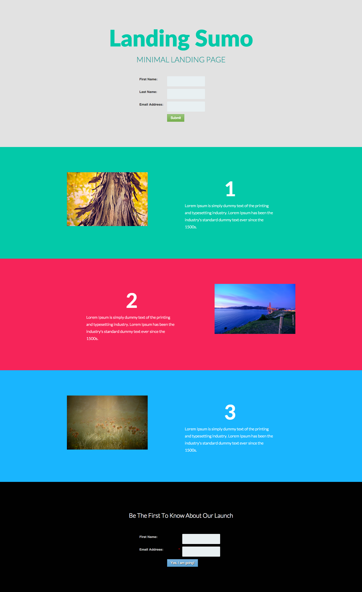

# Modello 10E {#template-10e}

Fare clic con il pulsante destro del mouse su [scarica modello 10E](https://51837-micrositemarketo.adobeio-static.net/lp-templates/template-10e.html) e selezionare **Salva collegamento con nome...**

>[!NOTE]
>
>I passaggi completi su come scaricare e importare un modello [&#x200B; si trovano qui](/help/marketo/product-docs/demand-generation/landing-pages/landing-page-templates/guided-landing-page-template-list.md#how-to-import){target="_blank"}.

Questo modello include i seguenti contenuti:

* Una sezione primaria

  * include un&#39;intestazione hero, un testo hero e un modulo

* Tre sezioni di corpo (facoltativo)
* Un piè di pagina (facoltativo)

**Fare clic con il pulsante destro del mouse qui sotto (e selezionare _Salva collegamento con nome..._) per scaricare questo modello:**

[Modello 10E.html](https://51837-micrositemarketo.adobeio-static.net/lp-templates/template-10e.html)
