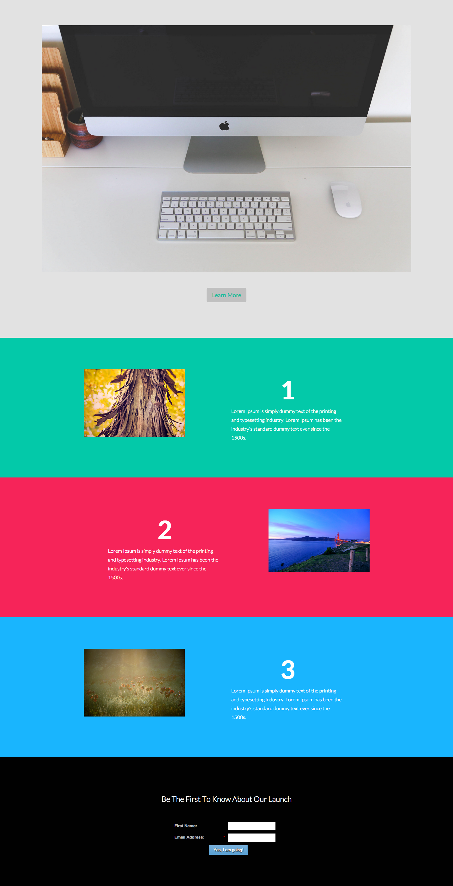

# Modello 10F {#template-10f}

Fare clic con il pulsante destro del mouse per [scaricare il modello 10F](https://experienceleague.adobe.com/landing/marketo/lp-templates/template-10f.html)

Questo modello include i seguenti contenuti:

* Una sezione primaria

   * include un&#39;immagine protagonista e un pulsante

* Tre sezioni di corpo (facoltativo)
* Un piè di pagina (facoltativo)

**Fare clic con il pulsante destro del mouse di seguito per scaricare il modello:**

[Modello 10F.html](https://experienceleague.adobe.com/landing/marketo/lp-templates/template-10f.html)
