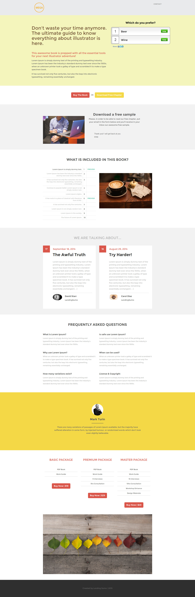

# Modello 12C {#template-12c}

Fare clic con il pulsante destro del mouse per [scaricare il modello 12C](https://experienceleague.adobe.com/landing/marketo/lp-templates/template-12c.html?lang=it)

Questo modello include i seguenti contenuti:

* Intestazione A (facoltativa)
* Una sezione primaria

   * include titolo principale, testo principale e sondaggio

* Sei sezioni di carrozzeria (facoltativo)
* Piè di pagina (facoltativo)

**Fare clic con il pulsante destro del mouse di seguito per scaricare il modello:**

[Modello 12C.html](https://experienceleague.adobe.com/landing/marketo/lp-templates/template-12c.html?lang=it)
