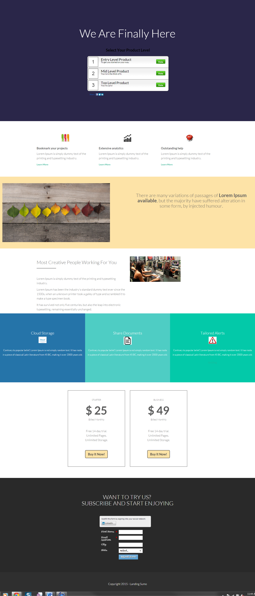

# Modello 13-C {#template-c}

Fare clic con il pulsante destro del mouse su [Scarica modello 13-C](http://docs.marketo.com/download/attachments/9437792/template-13c.html?version=1&amp;modificationdate=1438980021000&amp;api=v2)

Questo modello include il contenuto seguente:

* Sezione principale

   * include titolo hero e sondaggio

* Cinque sezioni corpo (facoltativo)
* Piè di pagina (facoltativo)

Fai clic con il pulsante destro del mouse qui sotto per scaricare il modello:

[Template13-C.html](http://docs.marketo.com/download/attachments/9437792/template-13c.html?version=1&amp;modificationdate=1438980021000&amp;api=v2)
