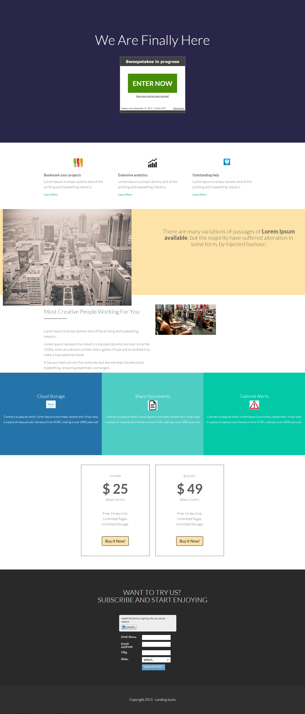

# Modello 13D {#template-13d}

Fare clic con il pulsante destro del mouse per [scaricare il modello 13D](https://experienceleague.adobe.com/landing/marketo/lp-templates/template-13d.html)

Questo modello include i seguenti contenuti:

* Una sezione primaria

   * include il titolo hero e le puntate

* Cinque sezioni di carrozzeria (facoltativo)
* Piè di pagina (facoltativo)

**Fare clic con il pulsante destro del mouse di seguito per scaricare il modello:**

[Modello 13D.html](https://experienceleague.adobe.com/landing/marketo/lp-templates/template-13d.html)
