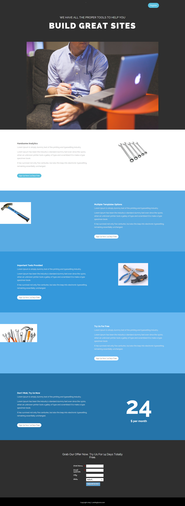

# Modello 15A {#template-15a}

Fare clic con il pulsante destro del mouse per [scaricare il modello 15A](https://experienceleague.adobe.com/landing/marketo/lp-templates/template-15a.html)

Questo modello include i seguenti contenuti:

* Una sezione primaria

   * include il titolo e l&#39;immagine protagonista

* Cinque sezioni di carrozzeria (facoltativo)
* Piè di pagina (facoltativo)

**Fare clic con il pulsante destro del mouse di seguito per scaricare il modello:**

[Modello 15A.html](https://experienceleague.adobe.com/landing/marketo/lp-templates/template-15a.html)
