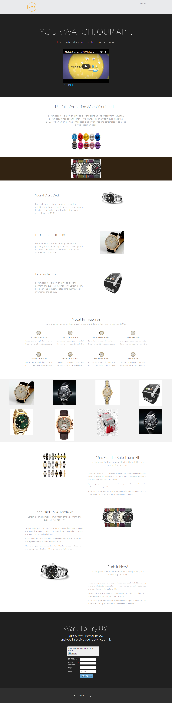

# Modello 16B {#template-16b}

Fare clic con il pulsante destro del mouse su [scarica modello 16B](https://51837-micrositemarketo.adobeio-static.net/lp-templates/template-16b.html) e selezionare **Salva collegamento con nome...**

>[!NOTE]
>
>I passaggi completi su come scaricare e importare un modello [ si trovano qui](/help/marketo/product-docs/demand-generation/landing-pages/landing-page-templates/guided-landing-page-template-list.md#how-to-import){target="_blank"}.

Questo modello include i seguenti contenuti:

* Intestazione A (facoltativa)
* Una sezione primaria

  * Include titolo e video dell&#39;eroe

* Sei sezioni del corpo

**Fare clic con il pulsante destro del mouse qui sotto (e selezionare _Salva collegamento con nome..._) per scaricare questo modello:**

[Modello 16B.html](https://51837-micrositemarketo.adobeio-static.net/lp-templates/template-16b.html)
