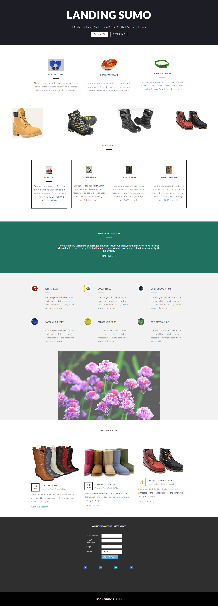

# Modello 17A {#template-17a}

Fare clic con il pulsante destro del mouse per [scaricare il modello 17A](https://experienceleague.adobe.com/landing/marketo/lp-templates/template-17a.html?lang=it)

Questo modello include i seguenti contenuti:

* Una sezione primaria

   * include titolo principale, testo principale e due pulsanti

* Sei sezioni di carrozzeria (facoltativo)
* Piè di pagina (facoltativo)

**Fare clic con il pulsante destro del mouse di seguito per scaricare il modello:**

[Modello 17A.html](https://experienceleague.adobe.com/landing/marketo/lp-templates/template-17a.html?lang=it)
