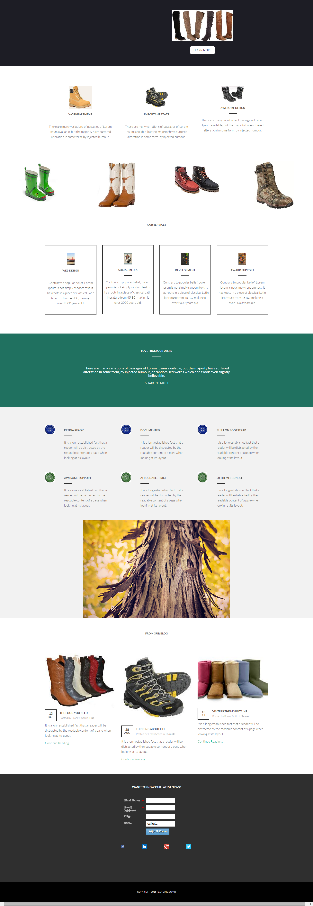

# Modello 17E {#template-17e}

Fare clic con il pulsante destro del mouse per [scaricare il modello 17E](https://experienceleague.adobe.com/landing/marketo/lp-templates/template-17e.html)

Questo modello include i seguenti contenuti:

* Una sezione primaria

   * include immagine protagonista e pulsante

* Sei sezioni di carrozzeria (facoltativo)
* Piè di pagina (facoltativo)

**Fare clic con il pulsante destro del mouse di seguito per scaricare il modello:**

[Modello 17E.html](https://experienceleague.adobe.com/landing/marketo/lp-templates/template-17e.html)
