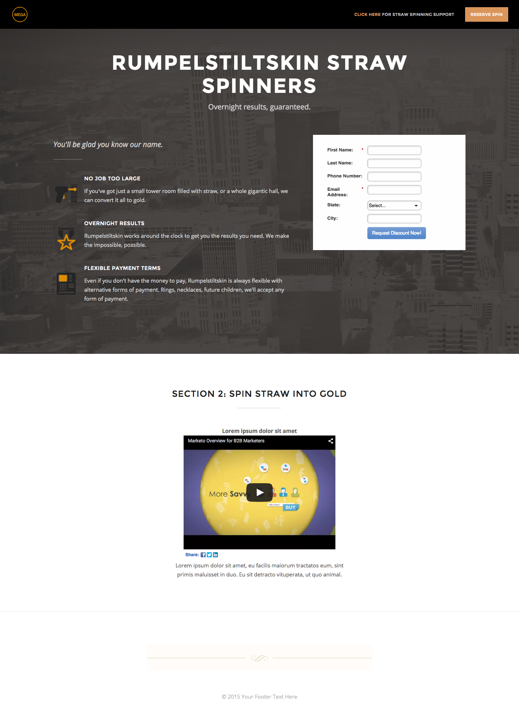

# Modello 2B {#template-2b}

[Scarica il modello 2B](https://experienceleague.adobe.com/landing/marketo/lp-templates/template-2b.html)

Questo modello include il seguente contenuto:

* Intestazione con logo e pulsante (facoltativo)
* Una sezione primaria

   * include immagine di sfondo eroe, intestazione, slogan, elenco puntato e modulo.

* Una sezione corpo con video e testo (facoltativo)
* Piè di pagina (facoltativo)

**Fai clic qui sotto per scaricare questo modello:**

[Modello 2B.html](https://experienceleague.adobe.com/landing/marketo/lp-templates/template-2b.html)
