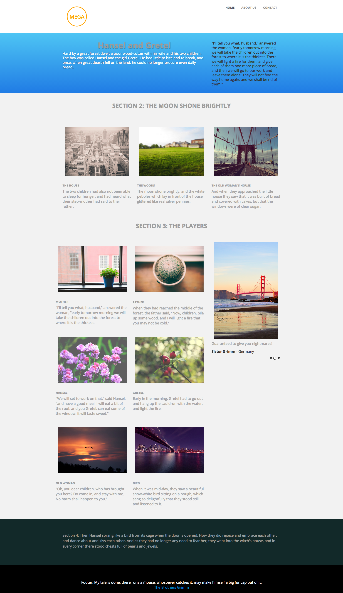

# Modello 3D {#template-3d}

Fare clic con il pulsante destro del mouse per [scaricare il modello 3D](https://experienceleague.adobe.com/landing/marketo/lp-templates/template-3d.html?lang=it)

Questo modello include i seguenti contenuti:

* Un&#39;intestazione con logo e 3 pulsanti (opzionale)
* Una sezione primaria

   * include il testo principale.

* Tre sezioni di corpo (facoltativo)
* Piè di pagina (facoltativo)

**Fare clic con il pulsante destro del mouse di seguito per scaricare il modello:**

[Modello 3D.html](https://experienceleague.adobe.com/landing/marketo/lp-templates/template-3d.html?lang=it)
