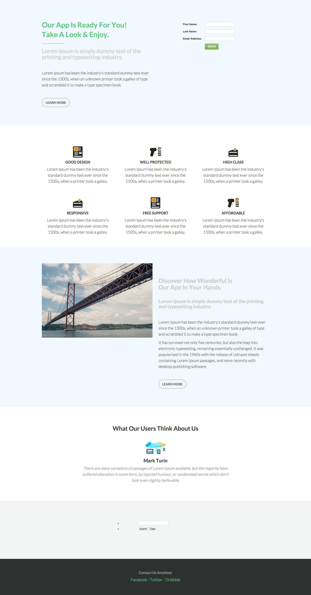

# Modello 6B {#template-6b}

Fare clic con il pulsante destro del mouse per [scarica modello 6B](https://experienceleague.adobe.com/landing/marketo/lp-templates/template-6b.html)

Questo modello include i seguenti contenuti:

* Una sezione primaria

   * include il modulo hero, il titolo, il sottotitolo, il corpo del testo e il pulsante.

* Quattro sezioni del corpo (facoltativo)
* Piè di pagina (facoltativo)

**Fai clic con il pulsante destro del mouse qui sotto per scaricare questo modello:**

[Modello 6B.html](https://experienceleague.adobe.com/landing/marketo/lp-templates/template-6b.html)
