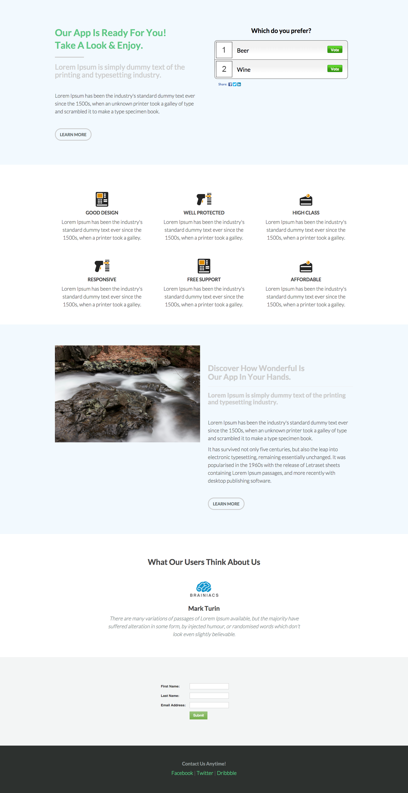

# Modello 6C {#template-6c}

[Scarica modello 6C](https://experienceleague.adobe.com/landing/marketo/lp-templates/template-6c.html)

Questo modello include il seguente contenuto:

* Una sezione primaria

   * include sondaggio eroe, titolo, sottotitolo, testo del corpo e pulsante.

* Quattro sezioni del corpo (facoltativo)
* Piè di pagina (facoltativo)

**Fai clic qui sotto per scaricare questo modello:**

[Modello 6C.html](https://experienceleague.adobe.com/landing/marketo/lp-templates/template-6c.html)
