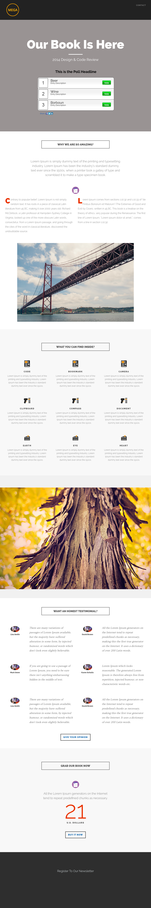

# Modello 8D {#template-8d}

[Scarica modello 8D](https://experienceleague.adobe.com/landing/marketo/lp-templates/template-8d.html)

Questo modello include il seguente contenuto:

* Intestazione A (opzionale)
* Una sezione primaria

   * include un&#39;intestazione eroe, un testo eroe e un sondaggio

* Cinque sezioni del corpo (facoltativo)
* Un piè di pagina (facoltativo)

**Fai clic qui sotto per scaricare questo modello:**

[Modello 8D.html](https://experienceleague.adobe.com/landing/marketo/lp-templates/template-8d.html)
