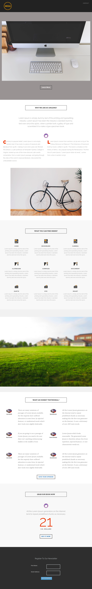

# Modello 8G {#template-8g}

Fare clic con il pulsante destro del mouse per [scaricare il modello 8G](https://experienceleague.adobe.com/landing/marketo/lp-templates/template-8g.html?lang=it)

Questo modello include i seguenti contenuti:

* Intestazione A (facoltativa)
* Una sezione primaria

   * include un&#39;immagine protagonista e un pulsante

* Cinque sezioni di carrozzeria (facoltativo)
* Un piè di pagina (facoltativo)

**Fare clic con il pulsante destro del mouse di seguito per scaricare il modello:**

[Modello 8G.html](https://experienceleague.adobe.com/landing/marketo/lp-templates/template-8g.html?lang=it)
