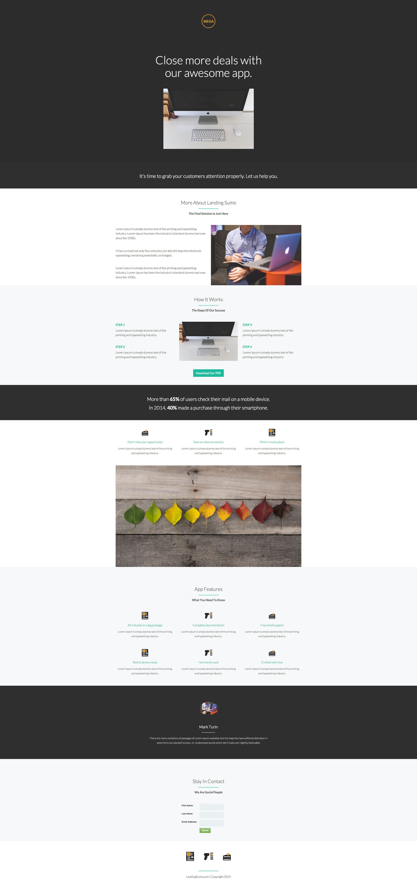

# Modello 9B {#template-9b}

Fare clic con il pulsante destro del mouse su [scarica modello 9B](https://51837-micrositemarketo.adobeio-static.net/lp-templates/template-9b.html) e selezionare **Salva collegamento con nome...**

>[!NOTE]
>
>I passaggi completi su come scaricare e importare un modello [ si trovano qui](/help/marketo/product-docs/demand-generation/landing-pages/landing-page-templates/guided-landing-page-template-list.md#how-to-import){target="_blank"}.

Questo modello include i seguenti contenuti:

* Una sezione primaria

  * include un&#39;immagine logo, un&#39;intestazione hero e un&#39;immagine hero

* Otto sezioni del corpo (facoltativo)
* Un piè di pagina (facoltativo)

**Fare clic con il pulsante destro del mouse qui sotto (e selezionare _Salva collegamento con nome..._) per scaricare questo modello:**

[Modello 9B.html](https://51837-micrositemarketo.adobeio-static.net/lp-templates/template-9b.html)
