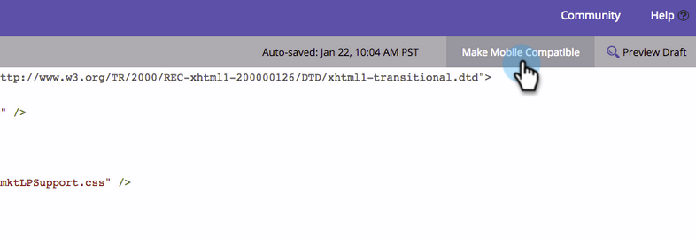

# Rendi compatibile con dispositivi mobili un modello di pagina di destinazione in formato libero esistente {#make-an-existing-free-form-landing-page-template-mobile-compatible}

Questa operazione può essere eseguita in due posizioni, Editor modelli e Editor pagina di destinazione.

## Eseguire l’aggiornamento dall’Editor modelli {#upgrade-from-the-template-editor}

1. Vai a **Design Studio**.

   

1. Seleziona **Modelli**.

   

1. Seleziona un modello in cui **Compatibile con dispositivi mobili** è **No**.

   

1. Clic **Modifica bozza**.

   

1. Clic **Rendi Mobile Compatibile**.

   

1. Clic **Aggiorna**.

   

   Il modello della pagina di destinazione è ora compatibile con dispositivi mobili.

   >[!NOTE]
   >
   >L’aggiornamento dovrebbe essere innocuo, ma assicurati di controllare le pagine per eventuali discrepanze. L&#39;aggiornamento creerà le bozze di tutte le pagine di destinazione che utilizzano tale modello.

   

## Cosa rende un modello compatibile per dispositivi mobili? {#what-makes-a-template-mobile-compatible}

Grandi domande! Il modello deve avere i seguenti tag:

`<pre data-theme="Confluence">Must have <!DOCTYPE HTML> Must have a <HEAD> element Must have a <TITLE> in the <HEAD> element Must have <META CHARSET="UTF-8"> within the <HEAD> element Must have a <BODY> element that contains one (and only one) 

</pre>`

Se tutto sembra a posto, vedrai questo messaggio.

Se si verifica un errore, viene visualizzato un messaggio di errore, fare clic su Ripristina per risolvere il problema e ripetere il processo di convalida.

Se apporti modifiche al modello, fai clic su Azioni modello e seleziona Convalida compatibilità mobile.

## Aggiornamento di un modello dall’Editor pagina di destinazione in formato libero {#upgrading-a-template-from-the-free-form-landing-page-editor}

Quando modifichi una pagina di destinazione e fai clic sulla scheda mobile, a volte noterai che il modello non è stato aggiornato. Non abbiate paura! Puoi aggiornarla proprio qui.

1. Fai clic su **Dispositivi mobili** scheda.

   

1. Selezionare la casella di controllo e fare clic su **Attiva**.

   

   >[!NOTE]
   >
   >L’attivazione della versione mobile di un modello creerà le bozze di tutte le pagine di destinazione che lo utilizzano.

Fantastico! Ora puoi [personalizzare la visualizzazione per dispositivi mobili](/help/marketo/product-docs/demand-generation/landing-pages/free-form-landing-pages/customize-mobile-view-for-your-free-form-landing-page.md) di tutte le pagine di destinazione che utilizzano questo modello.
