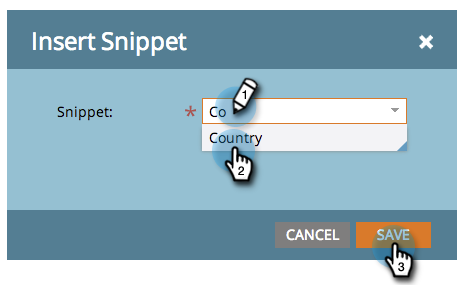

# Aggiungere uno snippet a una pagina di destinazione {#add-a-snippet-to-a-landing-page}

I frammenti sono piccoli frammenti di HTML che possono seguire le regole e contenere contenuti personalizzati.

>[!PREREQUISITES]
>
>[Crea snippet](/help/marketo/product-docs/personalization/segmentation-and-snippets/snippets/create-a-snippet.md)

1. Seleziona la pagina di destinazione e fai clic su **[!UICONTROL Edit Draft]**.

   

1. Nell&#39;editor pagina di destinazione, trascinare sull&#39;elemento **[!UICONTROL Snippet]**.

   

1. Trovare il frammento, selezionarlo e fare clic su **[!UICONTROL Save]**.

   

   >[!TIP]
   >
   >Se non riesci a trovare il frammento, assicurati che sia stato approvato prima.

   >[!NOTE]
   >
   >Se desideri aggiungere uno snippet a una pagina di destinazione guidata, consulta [questo articolo](/help/marketo/product-docs/demand-generation/landing-pages/landing-page-templates/create-a-guided-landing-page-template.md).

Ottimo lavoro! Ora sai come aggiungere snippet alle pagine di destinazione.
