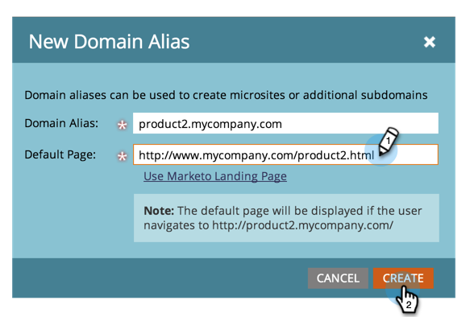

# Aggiungi CNAME aggiuntivi per pagine di destinazione {#add-additional-landing-page-cnames}

Puoi aggiungere CNAME per pagine di destinazione per consentire a URL diversi di puntare alle pagine di destinazione di Marketo. Seguendo i passaggi seguenti potrai gestire più domini.

>[!CAUTION]
>
>I cookie non sono condivisibili tra i domini.

>[!TIP]
>
>**Stesso dominio di primo livello - Buono! I cookie sono condivisi**.  **andare**.mycompany.com > **info**.miasocietà.com
>
>**Diversi domini di primo livello - Cattivo! I cookie sono _not_ condiviso**.  vai.**mia azienda**.com > vai.**mynewcompany**.com

>[!NOTE]
>
>**Autorizzazioni amministratore richieste**

## Trova La Stringa Account {#find-your-account-string}

1. Vai a **Amministratore** area e fai clic su **Pagine di destinazione**.

   

1. Copia il **Stringa account** dal **Impostazioni** sezione .

   

1. Prendi nota del passaggio successivo.

## Invia richiesta all&#39;IT {#send-request-to-it}

1. Chiedi al tuo reparto IT di configurare il seguente CNAME: (Sostituisci la parola [CNAME] con il CNAME di tua scelta e [STRINGA ACCOUNT] con il testo del passaggio precedente).

   [CNAME].YourCompany.com > [STRINGA ACCOUNT].mktoweb.com

## Aggiungi un nuovo CNAME {#add-a-new-cname}

1. Una volta creato il CNAME dal reparto IT, vai a **Amministratore** quindi fai clic su **Pagine di destinazione**.

   

1. Fai clic su **Nuovo** quindi seleziona **Nuovo alias di dominio**.

   

1. Inserisci il tuo **Alias di dominio.** La **Pagina predefinita** viene visualizzato se il visitatore non inserisce un URL. Inserisci dove dovrebbero andare in quel caso.

   >[!NOTE]
   >
   >Per la pagina predefinita, puoi selezionare una pagina di destinazione o un URL esterno, ad esempio il tuo sito web pubblico.

   

1. Inserisci il tuo **Pagina predefinita** e fai clic su **Crea**.

   

Bello! Ora sai cosa fare se vuoi aggiungere un CNAME.
