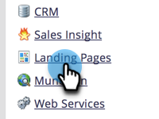

# Aggiungi altri CNAME per pagina di destinazione {#add-additional-landing-page-cnames}

Puoi aggiungere i CNAME della pagina di destinazione per consentire a URL diversi di puntare alle pagine di destinazione di Marketo. Segui i passaggi seguenti per gestire più domini.

>[!CAUTION]
>
>I cookie non sono condivisibili tra domini diversi.

>[!TIP]
>
>**Stesso dominio di primo livello - Buono! I cookie sono condivisi**.  **vai**.mycompany.com > **info**.mycompany.com
>
>**Domini di primo livello diversi: non valido I cookie sono _non_ condiviso**.  vai.**mia azienda**.com > vai.**mynewcompany**.com

>[!NOTE]
>
>**Autorizzazioni amministratore richieste**

1. Vai a **Amministratore** area.

   

1. Clic **Il mio account**.

   

1. Scorri verso il basso fino a &quot;Informazioni di supporto&quot; e copia il tuo ID Munchkin.

   

## Invia richiesta al reparto IT {#send-request-to-it}

1. Chiedi al tuo reparto IT di impostare il seguente CNAME: (Sostituisci la parola [CNAME] con il CNAME desiderato e [ID Munchkin] con il testo del passaggio precedente).

   [CNAME].YourCompany.com > [ID Munchkin].mktoweb.com

## Aggiungi un nuovo CNAME {#add-a-new-cname}

1. Una volta che il reparto IT ha creato il CNAME, vai al **Amministratore** area.

   

1. Clic **Pagine di destinazione**.

   

1. Clic **Nuovo** quindi seleziona **Nuovo alias di dominio**.

   

1. Immetti il **Alias di dominio.** Il **Pagina predefinita** viene visualizzato se il visitatore non inserisce un URL. In tal caso, specifica il percorso da seguire.

   >[!NOTE]
   >
   >Per Pagina predefinita, puoi selezionare una pagina di destinazione o un URL esterno, ad esempio il sito web pubblico.

   

1. Immetti il **Pagina predefinita** e fai clic su **Crea**.

   

Bello! Ora sai cosa fare se mai vorrai aggiungere un CNAME.
