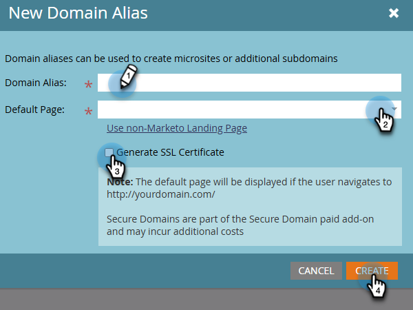

# Aggiungere SSL alle pagine di destinazione {#add-ssl-to-your-landing-pages}

La crittografia SSL (Secure Socket Layer) consente di rendere sicure tutte le pagine di destinazione di un’istanza di Marketo Engage.

Quando si compila un modulo web o si visita una pagina di destinazione ospitata da Marketo Engage, per impostazione predefinita le informazioni vengono inviate tramite un protocollo non sicuro (HTTP). In base alla politica aziendale, potrebbe essere utile proteggere le informazioni inviate a Marketo tramite (HTTPS). Ad esempio, quando visiti `http://info.mydomain.com/`, adesso sarà `https://info.mydomain.com/`.

Marketo Engage tiene traccia di &quot;Visited Web Page&quot; e &quot;Click Link on Web Page&quot; per impostazione predefinita su un protocollo HTTP non sicuro. Se desideri proteggere i collegamenti di tracciamento con il proprio certificato, è necessario che Marketo crei un server non condiviso separato per abilitarlo. Proteggere tutti gli aspetti dell’interazione di un contatto con te in genere significa proteggere sia le pagine di destinazione che i collegamenti di tracciamento.

>[!IMPORTANT]
>
>Prima di aggiungere un SSL, assicurati di controllare il contratto per il numero totale di domini che sei autorizzato ad aggiungere. In caso contrario, è possibile che venga applicata una tariffa. Se non riesci a trovare le informazioni, rivolgiti al team dell’account di Adobe (il tuo account manager) per maggiori dettagli.

## Abilita certificazione SSL {#enable-ssl-certification}

Aggiungi automaticamente SSL per tutti gli alias di dominio creati come parte delle regole della pagina di destinazione.

1. Vai all&#39;area **Amministratore**.

   

1. Seleziona **Pagine di destinazione** dalla struttura. Nella scheda **Regole**, fai clic sull&#39;elenco a discesa **Nuovo** e seleziona **Nuovo alias di dominio**.

   

1. Immetti l&#39;_alias di dominio_ e la _pagina predefinita_. Selezionare la casella di controllo **Genera certificato SSL**. Al termine, fai clic su **Crea**.

   

Questo aggiunge automaticamente un certificato SSL per questo dominio.

## Abilita SSL per il dominio predefinito {#enable-ssl-default-domain}

Per abilitare SSL per il dominio predefinito, segui la procedura riportata di seguito.

1. Sempre nella sezione **Amministratore**, seleziona **Pagine di destinazione**. Fai clic sul pulsante arancione **Modifica** accanto a _Impostazioni_.

   {width="800" zoomable="yes"}

   >[!NOTE]
   >
   >Se lo desideri, puoi anche modificare il nome di dominio qui (è richiesto un dominio valido).

1. Seleziona la casella di controllo &quot;Genera certificato SSL&quot; e fai clic su Salva.

   

>[!NOTE]
>
>* La colonna Certificato SSL nell’elenco mostra lo stato del certificato per tutti gli alias di dominio creati dopo il rilascio di questa funzione (25 aprile 2025). Se SSL era abilitato per un dominio tramite il supporto Marketo, il certificato continuerà a esistere ma non verrà visualizzato nella tabella. Questa tabella riflette solo i certificati SSL per i domini aggiunti utilizzando i passaggi descritti in questo articolo.
>
>* Possono essere necessari fino a tre minuti perché SSL sia nello stato READY. È necessario aggiornare la pagina per visualizzare le modifiche.

## Messaggi di errore {#error-messages}

Di seguito sono riportati i messaggi di errore che potresti ricevere insieme alle relative definizioni.

<table><thead>
  <tr>
    <th>Errore</th>
    <th>Dettagli</th>
  </tr></thead>
<tbody>
  <tr>
    <td><i>Errore imprevisto durante la creazione di un dominio. Contatta il supporto per assistenza.</i></td>
    <td>Si è verificato un errore imprevisto. Raccogliere i registri e i dettagli degli errori e inoltrare il problema al <a href="https://nation.marketo.com/t5/support/ct-p/Support" target="_blank">Supporto Marketo</a>.</td>
  </tr>
  <tr>
    <td><i>Dominio predefinito non trovato. Contatta il supporto per assistenza.</i></td>
    <td>Si è verificato un problema durante il tentativo di individuare il dominio predefinito. Rivolgiti al Supporto tecnico per consentire loro di svolgere indagini approfondite.</td>
  </tr>
  <tr>
    <td><i>Il certificato SSL è già stato rilasciato.</i></td>
    <td>Esiste già un certificato SSL per questo dominio personalizzato. Non sono necessarie ulteriori azioni a meno che il certificato non sia scaduto o debba essere nuovamente rilasciato.</td>
  </tr>
  <tr>
    <td><i>Il dominio non è mappato al dominio predefinito.</i></td>
    <td>Il dominio personalizzato non è mappato correttamente al dominio predefinito. Verificare le impostazioni di mappatura del dominio e assicurarsi che la configurazione DNS punti al dominio predefinito corretto.</td>
  </tr>
  <tr>
    <td><i>Il dominio esiste già.</i></td>
    <td>Esiste già un dominio con lo stesso nome.</td>
  </tr>
</tbody></table>

## Aspetti da considerare {#things-to-note}

* **Mappatura DNS per il dominio in Marketo Engage**: prima di aggiungere domini nell&#39;interfaccia utente, è necessario [mappare i CNAME in un dominio fornito da Marketo](https://experienceleague.adobe.com/en/docs/marketo/using/getting-started/initial-setup/setup-steps#customize-your-landing-page-urls-with-a-cname){target="_blank"}.

* **SSL personalizzati**: se hai bisogno di un SSL personalizzato, invia un [ticket di supporto](https://nation.marketo.com/t5/support/ct-p/Support){target="_blank"}. Non utilizzare la casella di controllo self-service per la creazione SSL.

* **SSL preesistenti**: durante l&#39;aggiunta di un dominio, il sistema verifica la presenza di SSL preesistenti, che potrebbero essere stati creati manualmente in precedenza. Se si verifica questa convalida, crea il dominio senza selezionare la creazione SSL, che verrà connessa automaticamente. [Contatta il supporto](https://nation.marketo.com/t5/support/ct-p/Support){target="_blank"} per ulteriori dettagli/opzioni.

* **Aggiunta di certificati a domini esistenti**: l&#39;aggiunta di certificati a domini esistenti non è al momento supportata. Per i domini preesistenti o per i casi in cui non è stato possibile selezionare la casella del certificato SSL, è necessario contattare il [supporto Marketo](https://nation.marketo.com/t5/support/ct-p/Support){target="_blank"} per ottenere l&#39;aggiunta del certificato.

* **Eliminazione di domini**: l&#39;eliminazione di un dominio comporta l&#39;eliminazione automatica del certificato SSL.
