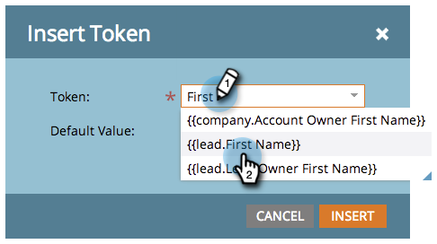

# Aggiungere testo e token a una pagina di destinazione {#add-text-and-tokens-to-a-landing-page}

>[!NOTE]
>
>I token sono supportati solo nelle pagine di destinazione di Marketo.

## Aggiungere testo RTF alla pagina di destinazione {#add-rich-text-to-your-landing-page}

1. Seleziona la pagina di destinazione e fai clic su **Modifica bozza**.

   

   >[!NOTE]
   >
   >La finestra di progettazione della pagina di destinazione viene aperta in una nuova finestra.

1. Trascina sopra **Rich Text** elemento.

   

1. Inserisci il testo desiderato e fai clic su **Salva**.

   

Ora che sai come aggiungere testo a una pagina di destinazione, è necessario aggiungere un token.

## Aggiungere un token alla pagina di destinazione {#add-a-token-to-your-landing-page}

I token sono bit di testo dinamici che possono personalizzare la pagina di destinazione.

>[!TIP]
>
>Cose come Nome provengono dal record della persona. Altri token provengono dalla scheda Token personali nel programma.

1. Seleziona la pagina di destinazione e fai clic su **Modifica bozza**.

   

   >[!NOTE]
   >
   >La finestra di progettazione della pagina di destinazione viene aperta in una nuova finestra.

1. Fare doppio clic sulla casella RTF a cui si desidera aggiungere il token.

   

1. Fai clic sull’icona Inserisci token .

   

1. Trova e seleziona il token desiderato.

   

1. Inserisci un **Valore predefinito** e fai clic su **Inserisci**.

   

1. Fai clic su **Salva**.

   

   Missione completata Ora disponi di un token sulla pagina di destinazione.
