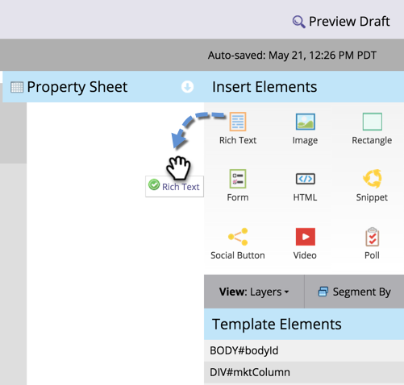
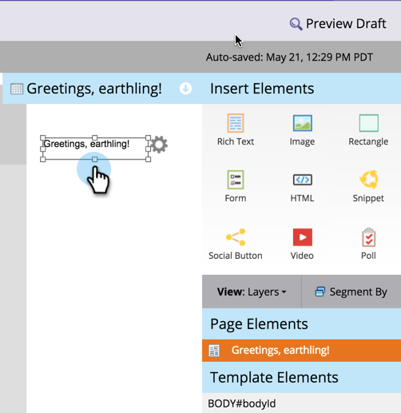
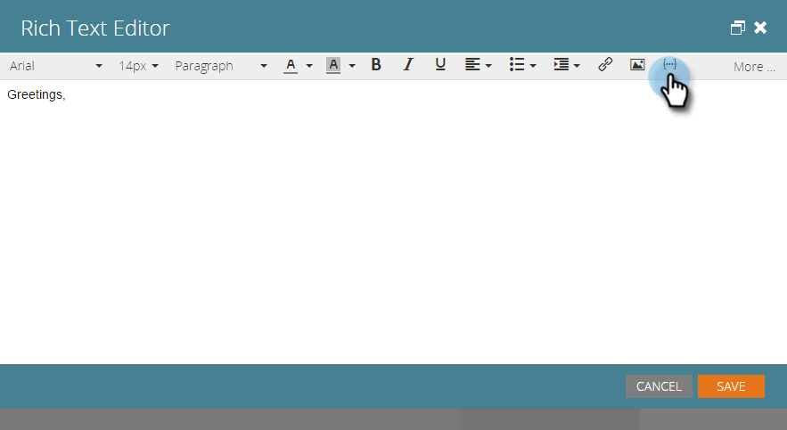
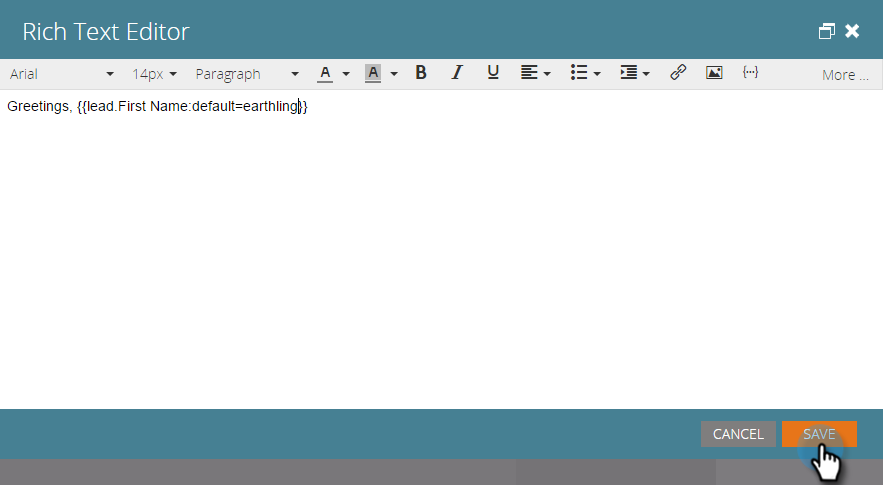

# Aggiungere testo e token a una pagina di destinazione {#add-text-and-tokens-to-a-landing-page}

>[!NOTE]
>
>I token sono supportati solo nelle pagine di destinazione di Marketo.

## Aggiungere testo formattato alla pagina di destinazione {#add-rich-text-to-your-landing-page}

1. Seleziona la pagina di destinazione e fai clic su **[!UICONTROL Edit Draft]**.

   

   >[!NOTE]
   >
   >Il designer della pagina di destinazione si apre in una nuova finestra.

1. Trascinare sull&#39;elemento **[!UICONTROL Rich Text]**.

   

1. Immettere il testo desiderato e fare clic su **[!UICONTROL Save]**.

   

Ora che sai come aggiungere testo a una pagina di destinazione, la sezione successiva tratta l’aggiunta di un token.

## Aggiungere un token alla pagina di destinazione {#add-a-token-to-your-landing-page}

I token sono parti di testo dinamiche che possono personalizzare la pagina di destinazione.

>[!TIP]
>
>Valori come Nome provengono dal record della persona. Altri token provengono dalla scheda I miei token del programma.

1. Seleziona la pagina di destinazione e fai clic su **[!UICONTROL Edit Draft]**.

   

   >[!NOTE]
   >
   >Il designer della pagina di destinazione si apre in una nuova finestra.

1. Fare doppio clic sulla casella di testo RTF a cui si desidera aggiungere il token.

   

1. Fai clic sull’icona Inserisci token.

   

1. Trova e seleziona il token desiderato.

   

1. Immettere **[!UICONTROL Default Value]** e fare clic su **[!UICONTROL Insert]**.

   

1. Fai clic su **[!UICONTROL Save]**.

   

   Ora hai un token nella pagina di destinazione.
