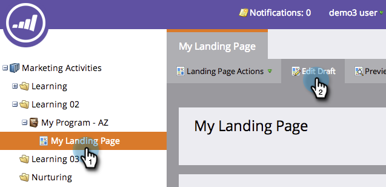

# Aggiungere testo e token a una pagina di destinazione {#add-text-and-tokens-to-a-landing-page}

>[!NOTE]
>
>I token sono supportati solo nelle pagine di destinazione Marketo.

## Aggiungere testo RTF alla pagina di destinazione {#add-rich-text-to-your-landing-page}

1. Selezionate la pagina di destinazione e fate clic su **Modifica bozza**.

   

   >[!NOTE]
   >
   >La finestra di progettazione della pagina di destinazione si apre in una nuova finestra.

1. Trascinare sull&#39;elemento **Rich Text**.

   

1. Inserite il testo desiderato e fate clic su **Salva**.

   

Ora che sai come aggiungere testo a una pagina di destinazione, lavoriamo per aggiungere un token.

## Aggiungere un token alla pagina di destinazione {#add-a-token-to-your-landing-page}

I token sono parti dinamiche di testo che possono personalizzare la pagina di destinazione.

>[!TIP]
>
>Cose come Nome vengono dal record di persona. Altri token provengono dalla scheda My Tokens nel programma.

1. Selezionate la pagina di destinazione e fate clic su **Modifica bozza**.

   

   >[!NOTE]
   >
   >La finestra di progettazione della pagina di destinazione si apre in una nuova finestra.

1. Fare doppio clic sulla casella RTF a cui si desidera aggiungere il token.

   

1. Fate clic sull&#39;icona Inserisci token.

   

1. Trova e seleziona il token di tua scelta.

   

1. Immettere un **Valore predefinito** e fare clic su **Inserisci**.

   

1. Fare clic su **Salva**.

   

   Missione Completa! Ora hai un token sulla pagina di destinazione.

