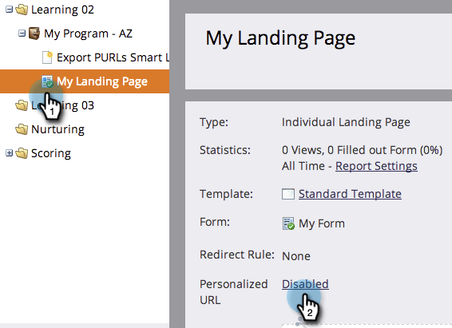

# Abilitare URL personalizzati per una pagina di destinazione {#enable-personalized-urls-for-a-landing-page}

Gli URL personalizzati funzionano correttamente per le campagne di stampa tramite posta.

>[!PREREQUISITES]
>
>[Abilita URL personalizzati per il tuo account](/help/marketo/product-docs/demand-generation/landing-pages/personalizing-landing-pages/enable-personalized-urls-for-your-account.md)

1. Selezionare una pagina di destinazione e fare clic sulle impostazioni per **[!UICONTROL Personalized URL]**.

   

1. Ora puoi controllare **[!UICONTROL Enable Personalized URL]** e fare clic su **[!UICONTROL Save]**.

   

Hai abilitato gli URL personalizzati per la pagina di destinazione. I visitatori che utilizzano tale URL verranno riconosciuti e i token funzioneranno correttamente.
