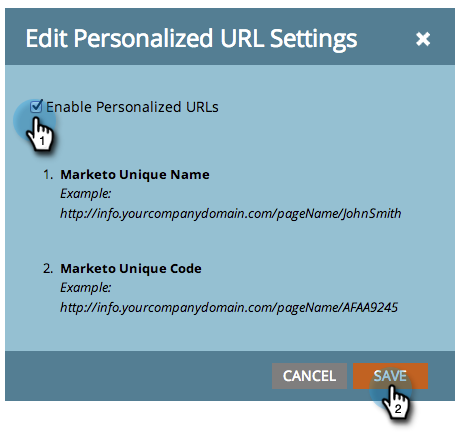

# Abilita URL personalizzati per il tuo account {#enable-personalized-urls-for-your-account}

Gli URL personalizzati sono ottimi per le campagne di stampa.

>[!NOTE]
>
>**Autorizzazioni amministratore richieste**

1. Vai a **Amministratore** e fai clic su **Pagine di destinazione**.

   

1. Fai clic su **Modifica**.

   

1. Controlla la **Abilita URL personalizzati** e fai clic su **Salva**.

   

Ottimo lavoro! Dopo aver abilitato i URL per il tuo account, puoi abilitarli per le singole pagine di destinazione.

>[!NOTE]
>
>Se due persone hanno gli stessi nomi e/o cognomi, il sistema aggiunge automaticamente un numero alla fine del loro nome PURL.
>
>Esempio:
>
>1. AnnaJones
>1. AnnaJones2
>1. AnnaJones3

