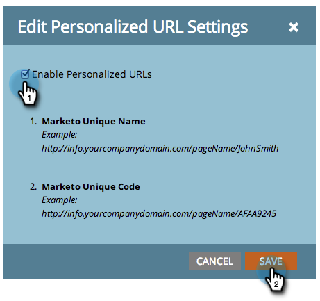

# Abilitare gli URL personalizzati per il tuo account {#enable-personalized-urls-for-your-account}

Gli URL personalizzati sono ideali per le campagne di stampa tramite posta.

>[!NOTE]
>
>**Autorizzazioni amministratore richieste**

1. Andare alla sezione **[!UICONTROL Admin]** e fare clic su **[!UICONTROL Landing Pages]**.

   

1. Fai clic su **[!UICONTROL Edit]**.

   

1. Selezionare la casella **[!UICONTROL Enable Personalized URLs]** e fare clic su **[!UICONTROL Save]**.

   

Ottimo lavoro! Ora che hai abilitato i PURL per il tuo account, puoi abilitarli per le singole pagine di destinazione.

>[!NOTE]
>
>Se due persone hanno lo stesso nome e/o cognome, il sistema aggiungerà automaticamente un numero alla fine del loro nome PURL.
>
>Esempio:
>
>1. AnnaJones
>1. AnnaJones2
>1. AnnaJones3
