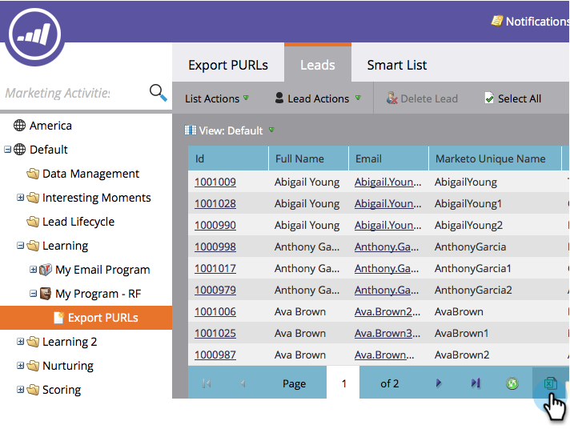

# Esportare un elenco con URL personalizzati {#export-a-list-with-personalized-urls}

>[!PREREQUISITES]
>
>* [Abilita URL personalizzati per il tuo account](/help/marketo/product-docs/demand-generation/landing-pages/personalizing-landing-pages/enable-personalized-urls-for-your-account.md)
>* [Abilitare gli URL personalizzati per una pagina di destinazione](/help/marketo/product-docs/demand-generation/landing-pages/personalizing-landing-pages/enable-personalized-urls-for-a-landing-page.md)

1. Seleziona l&#39;elenco o l&#39;elenco smart, fai clic su **Lead** per ottenere i risultati e quindi fare clic sull&#39;icona excel. IN LINEA Assicurati di avere **Codice univoco Marketo** e **Nome univoco Marketo** [colonne visibili](/help/marketo/product-docs/core-marketo-concepts/smart-lists-and-static-lists/using-smart-lists/create-and-change-views-for-lists-and-smart-list.md).

   

1. Controlla **Includi URL personalizzato**, trova e seleziona la pagina di destinazione per la quale desideri generare i URL.

   

1. Seleziona la **URL**.

   

   >[!TIP]
   >
   >Se visualizzi più URL per la stessa pagina di destinazione, è probabile che in passato tu abbia modificato l’URL delle pagine e creato un reindirizzamento.

1. Scegli un **Stile** e fai clic su **Esporta**.

   

1. Al termine dell’esportazione, fai clic sul pulsante **Scarica ora** per salvare il file.

   

   E hai finito! Ora disponi di un elenco di lead e URL personalizzati.

   

   >[!NOTE]
   >
   >In presenza di lead con lo stesso nome e cognome, i numeri vengono aggiunti automaticamente per garantire che gli URL rimangano univoci.
