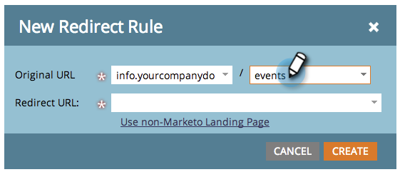

# Reindirizzare un percorso URL {#redirect-a-url-path}

Marketo consente di reindirizzare facilmente un percorso URL a qualsiasi pagina scelta. Ecco come.

>[!NOTE]
>
>**Autorizzazioni amministratore richieste**

1. In **[!UICONTROL Admin]**, fare clic su **[!UICONTROL Landing Pages]**.

   

1. Fare clic sulla scheda **[!UICONTROL Rules]**, quindi su **[!UICONTROL New]** e **[!UICONTROL New Redirect Rule]**.

   

1. Fai clic sul primo elenco a discesa **[!UICONTROL Original URL]** e seleziona il tuo CNAME Marketo.

   

   >[!NOTE]
   >
   >Ricorda che puoi reindirizzare solo gli URL che iniziano con il tuo Marketo [CNAME](/help/marketo/product-docs/demand-generation/landing-pages/landing-page-actions/customize-your-landing-page-urls-with-a-cname.md).

1. Digitare il percorso URL (o una pagina specifica) che si desidera reindirizzare nel secondo campo **[!UICONTROL Original URL]** a destra.

   

1. Fare clic su **[!UICONTROL Use non-Marketo Landing Page]**, digitare la pagina a cui si desidera reindirizzare i visitatori nel campo **[!UICONTROL Redirect URL]** e fare clic su **[!UICONTROL Create]**.

   

   Puoi [utilizzare anche le pagine di destinazione di Marketo](/help/marketo/product-docs/demand-generation/landing-pages/landing-page-actions/redirect-a-marketo-landing-page-to-another-page.md) come destinazione.

Congratulazioni! Hai reindirizzato correttamente il tuo percorso URL.

>[!MORELIKETHIS]
>
>[Reindirizza una pagina di destinazione di Marketo a un&#39;altra pagina](/help/marketo/product-docs/demand-generation/landing-pages/landing-page-actions/redirect-a-marketo-landing-page-to-another-page.md)
