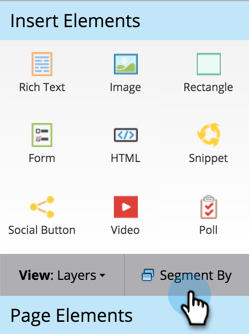
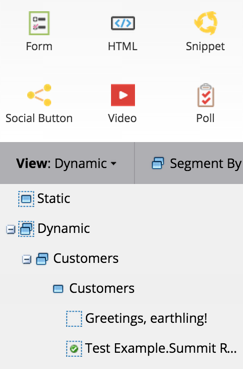

# Utilizzare il contenuto dinamico in una pagina di destinazione {#use-dynamic-content-in-a-landing-page}

>[!PREREQUISITES]
>
>* [Creare una segmentazione](/help/marketo/product-docs/personalization/segmentation-and-snippets/segmentation/create-a-segmentation.md)
>* [Creare una pagina di destinazione in formato libero](/help/marketo/product-docs/demand-generation/landing-pages/free-form-landing-pages/create-a-free-form-landing-page.md)
>* [Aggiungere un nuovo modulo a una pagina di destinazione in formato libero](/help/marketo/product-docs/demand-generation/landing-pages/free-form-landing-pages/add-a-new-form-to-a-free-form-landing-page.md)

L’utilizzo di contenuti dinamici nelle pagine di destinazione coinvolge le persone con informazioni mirate.

## Aggiungi segmentazione {#add-segmentation}

1. Vai a **Attività di marketing**.

   

   Fai clic sulla pagina di destinazione e quindi su Modifica bozza.

   

   Fai clic su Segmenta per.

   

   Inserisci il nome della segmentazione e fai clic su Salva.

   

   La segmentazione e i relativi segmenti vengono visualizzati in Dinamico a destra.

   

   >[!NOTE]
   >
   >Tutti gli elementi della pagina di destinazione sono statici per impostazione predefinita.

## Rendi elemento dinamico {#make-element-dynamic}

1. Trascina gli elementi da Static a **Dinamico**.

   

1. Puoi anche rendere gli elementi statici o dinamici dall’elemento **Impostazioni**.

   

## Applicare contenuti dinamici {#apply-dynamic-content}

1. Seleziona un elemento sotto un segmento, quindi fai clic su **Modifica**. Ripeti per ogni segmento.

   

1. Un segno di spunta verde indica il contenuto specifico del segmento. Un valore vuoto indica il contenuto predefinito del segmento.

   

   >[!CAUTION]
   >
   >Le modifiche al blocco di contenuto predefinito del segmento vengono applicate a tutti i segmenti.

   >[!TIP]
   >
   >Crea una pagina di destinazione predefinita prima di modificare il contenuto dei vari segmenti.

Voilà! Ora puoi inviare contenuti mirati.

>[!MORELIKETHIS]
>
>* [Anteprima di una pagina di destinazione con contenuto dinamico](/help/marketo/product-docs/demand-generation/landing-pages/landing-page-actions/preview-a-landing-page-with-dynamic-content.md)
>* [Utilizzo di contenuti dinamici in un messaggio e-mail](/help/marketo/product-docs/email-marketing/general/functions-in-the-editor/using-dynamic-content-in-an-email.md)
