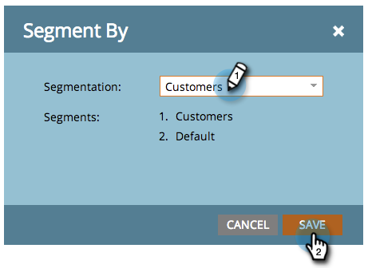
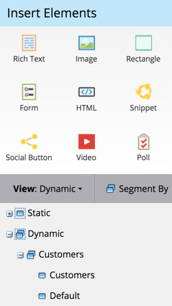
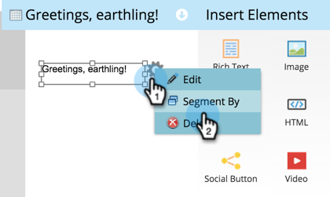

# Utilizzare il contenuto dinamico in una pagina di destinazione {#use-dynamic-content-in-a-landing-page}

>[!PREREQUISITES]
>
>* [Crea una segmentazione](/help/marketo/product-docs/personalization/segmentation-and-snippets/segmentation/create-a-segmentation.md)
>* [Crea una pagina di destinazione in formato libero](/help/marketo/product-docs/demand-generation/landing-pages/free-form-landing-pages/create-a-free-form-landing-page.md)
>* [Aggiungere un nuovo modulo a una pagina di destinazione in formato libero](/help/marketo/product-docs/demand-generation/landing-pages/free-form-landing-pages/add-a-new-form-to-a-free-form-landing-page.md)

L’utilizzo di contenuti dinamici nelle pagine di destinazione coinvolge le persone con informazioni mirate.

## Aggiungi segmentazione {#add-segmentation}

1. Passa a **[!UICONTROL Marketing Activities]**.

   

   Fai clic su **[!UICONTROL Landing Page]** e quindi su **[!UICONTROL Edit Draft]**.

   

   Fai clic su **[!UICONTROL Segment By]**.

   

   Immettere il nome **[!UICONTROL Segmentation]** e fare clic su **[!UICONTROL Save]**.

   

   La segmentazione e i relativi segmenti vengono visualizzati in **[!UICONTROL Dynamic]** a destra.

   

   >[!NOTE]
   >
   >Tutti gli elementi della pagina di destinazione sono **[!UICONTROL Static]** per impostazione predefinita.

## Rendi elemento dinamico {#make-element-dynamic}

1. Trascinare gli elementi da **[!UICONTROL Static]** a **[!UICONTROL Dynamic]**.

   

1. È inoltre possibile creare elementi [!UICONTROL Static] o [!UICONTROL Dynamic] dall&#39;elemento **[!UICONTROL Settings]**.

   

## Applicare contenuti dinamici {#apply-dynamic-content}

1. Selezionare un elemento sotto un segmento, quindi fare clic su **[!UICONTROL Edit]**. Ripeti per ogni segmento.

   

1. Un segno di spunta verde indica il contenuto specifico di un segmento. Un valore vuoto indica il contenuto predefinito del segmento.

   

   >[!CAUTION]
   >
   >Le modifiche al blocco di contenuto predefinito del segmento vengono applicate a tutti i segmenti.

   >[!TIP]
   >
   >Crea una pagina di destinazione predefinita prima di modificare il contenuto dei vari segmenti.

Ora puoi inviare contenuti mirati ai tuoi segmenti.

>[!MORELIKETHIS]
>
>* [Anteprima di una pagina di destinazione con contenuto dinamico](/help/marketo/product-docs/demand-generation/landing-pages/landing-page-actions/preview-a-landing-page-with-dynamic-content.md)
>* [Utilizzo di contenuti dinamici in un messaggio e-mail](/help/marketo/product-docs/email-marketing/general/functions-in-the-editor/using-dynamic-content-in-an-email.md)
