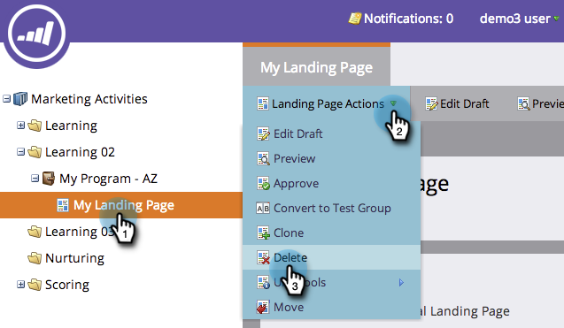

# Approvare, annullare l’approvazione o eliminare una pagina di destinazione {#approve-unapprove-or-delete-a-landing-page}

Le pagine di destinazione sono in modalità bozza finché non vengono approvate. L’approvazione rende disponibili le pagine nel resto del sistema. Quando modifichi una pagina di destinazione approvata, Marketo salva la bozza, ma continua a utilizzare la versione approvata finché non la approvi.

## Approvare una pagina di destinazione {#approve-a-landing-page}

1. Seleziona una pagina di destinazione e vai a **Azioni pagina di destinazione** e fai clic su **Approva**.

   >[!TIP]
   >
   >È possibile [approvare più pagine contemporaneamente](/help/marketo/product-docs/demand-generation/landing-pages/landing-page-actions/approve-multiple-landing-pages-at-once.md) per rendere la tua vita più facile.

   

1. Puoi anche fare clic con il pulsante destro del mouse sulla pagina di destinazione e fare clic su **Approva**.

   

   >[!NOTE]
   >
   >Una volta approvata, l’icona della pagina di destinazione avrà un segno di spunta verde.

## Annullare l’approvazione di una pagina di destinazione {#unapprove-a-landing-page}

1. Seleziona una pagina di destinazione e vai a **Azioni pagina di destinazione** e fai clic su **Annulla approvazione**.

   

1. Puoi anche fare clic con il pulsante destro del mouse sulla pagina di destinazione e fare clic su **Annulla approvazione**.

   

>[!NOTE]
>
>La pagina di destinazione non approvata non viene più pubblicata sul Web e non genera attività aggiuntive. I visitatori di pagine di destinazione non approvate e delle relative schede Facebook visualizzeranno le [Pagina di fallback](/help/marketo/product-docs/administration/settings/set-a-fallback-page.md).

## Eliminare una pagina di destinazione {#delete-a-landing-page}

1. Seleziona una pagina di destinazione e vai a **Azioni pagina di destinazione** e fai clic su **Elimina**.

   

   >[!NOTE]
   >
   >Non è possibile eliminare una pagina di destinazione approvata. Prima annulla la sua approvazione.

1. Puoi anche fare clic con il pulsante destro del mouse sulla pagina di destinazione e fare clic su **Elimina**.

   

## Eliminare più pagine di destinazione {#delete-multiple-landing-pages}

Eliminare più pagine di destinazione alla volta? Ecco come.

1. In Design Studio, fai clic su **Pagine di destinazione**.

   

1. Fai clic sulla prima pagina di destinazione che desideri eliminare, quindi premi Maiusc e fai clic sull’ultima.

   

   >[!TIP]
   >
   >È inoltre possibile utilizzare Ctrl+clic per eliminare più pagine di destinazione che non sono sequenziali.

1. Fai clic sul pulsante **Azioni pagina di destinazione** a discesa e seleziona **Elimina**.

   

1. Fai clic su **Elimina**.

   

Fantastico! Ora sai come approvare, annullare l’approvazione ed eliminare le pagine di destinazione.
