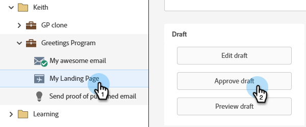

# Approvare, annullare l’approvazione o eliminare una pagina di destinazione {#approve-unapprove-or-delete-a-landing-page}

Le pagine di destinazione sono in modalità bozza finché non vengono approvate. L’approvazione rende le pagine disponibili nel resto del sistema. Quando modifichi una pagina di destinazione approvata, Marketo Engage salva la bozza, ma continua a utilizzare la versione approvata fino a quando la bozza non viene approvata.

## Approvare una pagina di destinazione {#approve-a-landing-page}

1. Selezionare la pagina di destinazione desiderata e fare clic su **[!UICONTROL Approve draft]**.

   

   >[!TIP]
   >
   >Se lo desideri, puoi [approvare più pagine contemporaneamente](/help/marketo/product-docs/demand-generation/landing-pages/landing-page-actions/approve-multiple-landing-pages-at-once.md).

Puoi anche fare clic con il pulsante destro del mouse sulla pagina di destinazione nella barra di navigazione a sinistra e selezionare **[!UICONTROL Approve]**.

>[!NOTE]
>
>A una pagina di destinazione approvata è stato aggiunto un segno di spunta verde.

## Annullare l’approvazione di una pagina di destinazione {#unapprove-a-landing-page}

1. Selezionare la pagina di destinazione desiderata e fare clic su **[!UICONTROL Unapprove]**.

   

Puoi anche fare clic con il pulsante destro del mouse sulla pagina di destinazione nella barra di navigazione a sinistra e selezionare **[!UICONTROL Unapprove]**.

>[!NOTE]
>
>La pagina di destinazione non approvata non viene più pubblicata sul Web e non genererà alcuna attività aggiuntiva. I visitatori delle pagine di destinazione non approvate e delle relative schede di Facebook visualizzeranno la [pagina di fallback](/help/marketo/product-docs/administration/settings/set-a-fallback-page.md).

## Eliminare una pagina di destinazione {#delete-a-landing-page}

1. Seleziona la pagina di destinazione desiderata. Fai clic sul menu a discesa **[!UICONTROL Landing Page Actions]** e seleziona **[!UICONTROL Delete]**.

   

   >[!IMPORTANT]
   >
   >Non puoi eliminare una pagina di destinazione approvata. Devi prima annullare l’approvazione.

Puoi anche fare clic con il pulsante destro del mouse sulla pagina di destinazione nella barra di navigazione a sinistra e selezionare **[!UICONTROL Delete]**.

## Eliminare più pagine di destinazione {#delete-multiple-landing-pages}

1. Nella schermata principale di [!UICONTROL Design Studio], fare clic su **[!UICONTROL Landing Pages]**.

   

1. Seleziona le pagine di destinazione desiderate. Fai clic sul menu a discesa **[!UICONTROL Landing Page Actions]** e seleziona **[!UICONTROL Delete]**.

   

1. Fai clic su **[!UICONTROL Delete]** per confermare.

   
