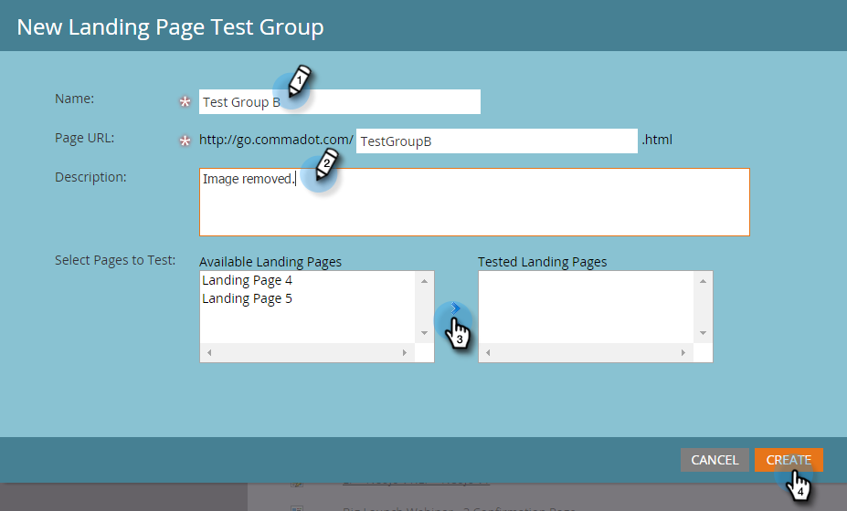

# Gruppi di test della pagina di destinazione {#landing-page-test-groups}

Marketo tiene traccia del numero di visualizzazioni di pagina e di completamenti di moduli su ogni pagina sottoposta a test all’interno di un gruppo di test. Puoi utilizzare i risultati del gruppo di test per decidere quale pagina di destinazione è più convincente. Ecco come creare un gruppo di test.

>[!PREREQUISITES]
>
>[Creare due o più pagine di destinazione](/help/marketo/getting-started/quick-wins/landing-page-with-a-form.md), preferibilmente con un modulo.

1. In Design Studio, fare clic su **[!UICONTROL New]**. Nel menu a discesa, seleziona **[!UICONTROL New Test Group]**.

   

   >[!NOTE]
   >
   >Gli altri modi per creare un gruppo di test sono:
   >
   >* Fare clic con il pulsante destro del mouse su una pagina di destinazione nella struttura e selezionare **[!UICONTROL Convert to Test Group]**
   >* Creare un gruppo di test della pagina di destinazione in un programma scegliendo **[!UICONTROL AB Test Group]** nel menu **[!UICONTROL New Local Asset]**

1. Immettere un nome e una descrizione facoltativa. Selezionare le pagine di destinazione che si desidera verificare e fare clic su **[!UICONTROL Create]**.

   

   >[!NOTE]
   >
   >Solo le pagine di destinazione non approvate saranno disponibili per la scelta.

1. Fare clic con il pulsante destro del mouse su ogni pagina di destinazione e selezionare **[!UICONTROL Approve]**.

   

1. Fare clic sul menu a discesa **[!UICONTROL Test Group Actions]** e selezionare **[!UICONTROL Approve Test Group]**.

   

   Tutto qui. Ora potrai confrontare le statistiche delle pagine di destinazione selezionate.

   

   >[!TIP]
   >
   >Per eliminare il gruppo di test, fare clic su **[!UICONTROL Test Group Actions]** e selezionare **[!UICONTROL Delete test group]**.
