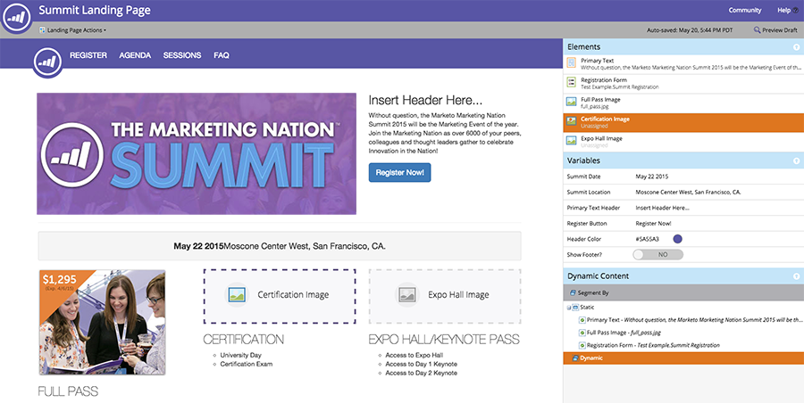

# Informazioni sulle pagine di destinazione in formato libero e guidato {#understanding-free-form-vs-guided-landing-pages}

Il modello scelto determina la modalità di modifica della pagina di destinazione in cui lavorerai. Esistono due percorsi possibili: [formato libero](/help/marketo/product-docs/demand-generation/landing-pages/free-form-landing-pages/create-a-free-form-landing-page.md) e [guidato](/help/marketo/product-docs/demand-generation/landing-pages/guided-landing-pages/create-a-guided-landing-page.md). Di seguito è riportato un breve riepilogo delle principali differenze.

## Pagine in formato libero {#free-form-pages}

* Trascina i contenuti desiderati ovunque li desideri.
* Il modello è simile a un elemento SlideMaster di PowerPoint, semplicemente uno sfondo.
* Crea una semplice versione mobile della pagina con un clic su un pulsante.
* Da utilizzare quando non si dispone di molto tempo o risorse tecniche.

## Pagine guidate {#guided-pages}

* Layout/struttura predefiniti guidati dal modello.
* Nell’editor è possibile personalizzare solo le regioni o le variabili definite come modificabili nel modello.
* Per modificare il layout e aggiungere altre risorse sono necessarie modifiche al codice.
* Osserva e percepisci in tutto il dispositivo in base alle regole integrate nel modello.
* Da utilizzare se hai codificato o acquistato modelli reattivi o desideri modificare un modello Marketo predefinito.

