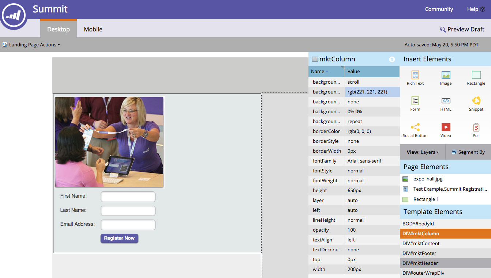

# Informazioni sulle pagine di destinazione gratuite e guidate {#understanding-free-form-vs-guided-landing-pages}

Il modello scelto determina la modalità di modifica della pagina di destinazione in cui lavorerete. Esistono due percorsi possibili: [free-form](/help/marketo/product-docs/demand-generation/landing-pages/free-form-landing-pages/create-a-free-form-landing-page.md) e [guidato](/help/marketo/product-docs/demand-generation/landing-pages/guided-landing-pages/create-a-guided-landing-page.md). Di seguito viene fornito un breve riepilogo delle differenze importanti.

## Pagine a forma libera {#free-form-pages}

* Trascinate e rilasciate il contenuto desiderato ovunque lo desideriate.
* Il modello è simile a uno SlideMaster in PowerPoint, semplicemente a uno sfondo.
* Crea una semplice versione mobile della pagina con un semplice clic di un pulsante.
* Utilizzata al meglio quando non hai molto tempo o risorse tecniche a tua disposizione.

## Pagine guidate {#guided-pages}

* Layout/struttura predefiniti guidati dal modello.
* Solo le aree o le variabili definite come modificabili nel modello possono essere personalizzate nell&#39;editor.
* Modifiche al codice necessarie per modificare il layout e aggiungere altre risorse.
* Aspetto tra i dispositivi determinato dalle regole integrate nel modello.
* Utilizzata per i modelli reattivi codificati o acquistati o per modificare un modello Marketo predefinito.

