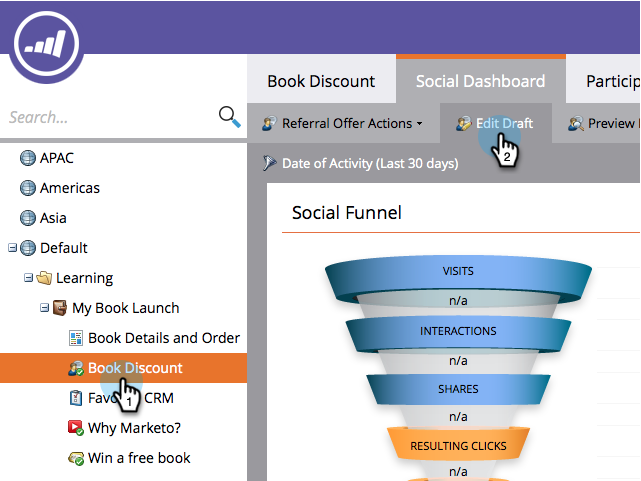

# Configurare l’acquisizione personale per un’app social {#configure-person-capture-for-a-social-app}

Quando crei una [offerta di riferimento](/help/marketo/product-docs/demand-generation/social/referral-offers/create-a-referral-offer.md) o [panorami](/help/marketo/product-docs/demand-generation/social/sweepstakes/create-sweepstakes.md), puoi configurare quali informazioni richiedi e quali informazioni richiedi alle persone per partecipare.

>[!NOTE]
>
>Questa informazione viene richiesta solo se non è stata fornita in precedenza.

1. Vai a **Attività di marketing**.

   

1. Seleziona l’app e fai clic su **Modifica bozza**.

   

1. Nell’editor di app social, vai a **Flusso di registrazione** > **Cattura della persona**.

   

1. Seleziona le informazioni da richiedere e indica i campi che sono specificamente richiesti per iscriversi all’offerta.

   

   Includi opzioni di marketing:

   * **Rinuncia**: La persona è sottoscritta per impostazione predefinita.
   * **Consenso**: La persona può scegliere di iscriversi.

   >[!NOTE]
   >
   >In entrambi i casi, i partecipanti riceveranno ancora il [_operativo_ e-mail](/help/marketo/product-docs/email-marketing/general/functions-in-the-editor/make-an-email-operational.md) dalla tua offerta.

1. Nella finestra Visualizza e modifica, fai clic su **Mostra modifiche** e modificare i messaggi nel prompt di condivisione.

   

>[!MORELIKETHIS]
>
>Ora puoi [configurare il flusso di iscrizione social](/help/marketo/product-docs/demand-generation/social/configuring-social-actions/configure-social-sign-up-share-flow.md) e modifica i messaggi di condivisione che verranno inviati a ogni social network.
