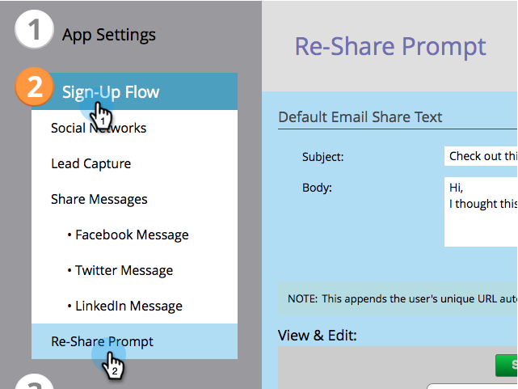

# Configurare nuovamente la condivisione di e-mail e richiedere un’app social {#configure-re-share-email-and-prompt-for-a-social-app}

Quando si crea un [offerta di riferimento](/help/marketo/product-docs/demand-generation/social/referral-offers/create-a-referral-offer.md) o un [pali](/help/marketo/product-docs/demand-generation/social/sweepstakes/create-sweepstakes.md), puoi invitare i partecipanti a condividere la tua offerta con altri amici come parte del processo di registrazione, nonché fornire il testo predefinito per l’e-mail di condivisione.

>[!NOTE]
>
>In un’offerta di riferimento, puoi anche [imposta come requisito la condivisione dell’offerta](/help/marketo/product-docs/demand-generation/social/social-functions/set-social-share-requirement.md) per iscriverti.

1. Vai a **Attività di marketing**.

   

1. Seleziona l’offerta di riferimento e fai clic su **Modifica bozza**.

   

1. Nell’editor delle offerte di riferimento, vai a **Flusso registrazione** > **Ricondividi richiesta**.

   

1. Modifica l’e-mail che verrà inviata agli amici del partecipante se questi sceglie di condividere.

   >[!NOTE]
   >
   >L’e-mail include automaticamente l’URL di condivisione univoco del partecipante.

1. In **Visualizza e modifica** finestra, fai clic su **Mostra modifiche** e modificare l’invito a condividere e le istruzioni per il tracciamento dell’avanzamento.

   

>[!MORELIKETHIS]
>
>Successivamente, puoi configurare [tracciare il flusso di avanzamento in un’offerta di riferimento](configure-track-progress-flow-for-a-referral-offer.md), o fai clic su **Fine** > **Approva e chiudi** a [pubblicare l’offerta di riferimento](/help/marketo/product-docs/demand-generation/social/referral-offers/publish-a-referral-offer.md) o [pali](/help/marketo/product-docs/demand-generation/social/sweepstakes/create-sweepstakes.md).
