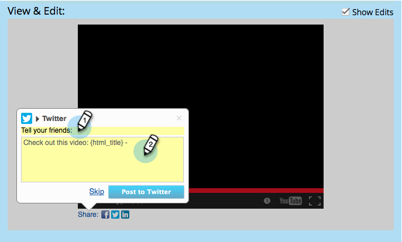
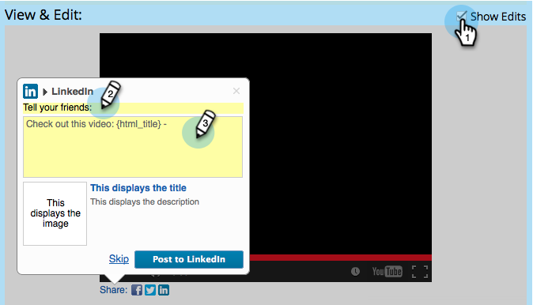

# Configura flusso consigli social {#configure-social-recommend-flow}

Quando crei un’app social, puoi configurare le scelte del social network e i prompt che un utente incontra durante la registrazione.

## Seleziona reti da condividere {#select-networks-for-sharing}

>[!NOTE]
>
>È molto simile a [configurazione del flusso di iscrizione/condivisione per social network](/help/marketo/product-docs/demand-generation/social/configuring-social-actions/configure-social-sign-up-share-flow.md), ma questo è per i collegamenti di condivisione _in_ l’app social.

1. Vai a **Attività di marketing**.

   

1. Seleziona l’app e fai clic su **Modifica bozza**.

   

1. Nell’editor delle app social, vai a **Flusso consigliato** > **Social network**.

   

1. Selezionare le reti a cui un utente può condividere.

   

## Configurare il messaggio di Facebook {#configure-the-facebook-message}

1. Configura il messaggio che verrà visualizzato nei post di Facebook.

   

   >[!NOTE]
   >
   >In una condivisione video, la miniatura viene generata automaticamente.

   Se si sceglie **Aggiungi contenuto dinamico**, i valori dei tag OpenGraph della pagina (og:title, og:caption e og:description) e la miniatura vengono aggiunti automaticamente ai post di Facebook. Vedere il passaggio successivo.

   Se si sceglie **Aggiungi contenuto statico**, immetti il titolo, la didascalia e la descrizione, quindi carica un&#39;immagine. Consulta i due passaggi successivi.

1. Nella finestra Visualizza e modifica, fai clic su **Mostra modifiche** per personalizzare il prompt di condivisione e il messaggio che verranno visualizzati nei post di Facebook.

   >[!TIP]
   >
   >Per ulteriori informazioni, consulta [Modifica impostazioni Facebook Rich Post](/help/marketo/product-docs/demand-generation/facebook/edit-facebook-rich-post-settings.md).

   

   >[!NOTE]
   >
   >Il [condividi URL](/help/marketo/product-docs/demand-generation/social/social-functions/choose-the-share-url-for-a-social-app.md) viene aggiunto automaticamente a tutti i messaggi di condivisione.

1. Se si sceglie **Aggiungi contenuto statico** modificare il titolo, la didascalia e la descrizione, quindi caricare un&#39;immagine personalizzata (dalle immagini e dai file di Marketo).

   

   Consulta [Aggiungere immagini e file a Marketo](/help/marketo/product-docs/demand-generation/images-and-files/add-images-and-files-to-marketo.md).

   >[!NOTE]
   >
   >Se carichi un’immagine, non la visualizzerai qui finché non chiudi e riapri l’editor dell’app social.

1. Clic **Successivo**.

Se selezioni , i valori dei tag OpenGraph della pagina (og:title, og:caption e og:description) e la miniatura vengono aggiunti automaticamente ai post di Facebook. Vedere il passaggio successivo.

## Configurare il messaggio di Twitter {#configure-the-twitter-message}

1. Fare clic per modificare il prompt di condivisione e il messaggio che verranno visualizzati nei tweet di Twitter.

   

   >[!TIP]
   >
   >Utilizzare {html_title} nel tweet per visualizzare automaticamente il titolo della pagina.

1. Clic **Successivo**.

## Configurare il messaggio di LinkedIn {#configure-the-linkedin-message}

1. Configura il messaggio che verrà visualizzato nei post di LinkedIn.

   

   Se si sceglie **Aggiungi dinamico** Il contenuto, i valori dei tag delle pagine (titolo e descrizione) e la miniatura vengono aggiunti automaticamente ai post di LinkedIn. Vedere il passaggio successivo.

   Se si sceglie **Aggiungi statico** contenuto, immetti il titolo, la didascalia e la descrizione, quindi carica un’immagine. Consulta i due passaggi successivi.

1. In **Visualizza e modifica** finestra, fai clic su **Mostra modifiche** e modificare il prompt di condivisione e il messaggio che verranno visualizzati nei post di LinkedIn.

   

   >[!TIP]
   >
   >Utilizzare {html_title} nel post per visualizzare automaticamente il titolo della pagina.

1. Se si sceglie **Aggiungi statico** contenuto precedente, modifica il titolo e la descrizione e carica un’immagine personalizzata (dalle immagini e dai file Marketo).

   

   Consulta [Aggiungere immagini e file a Marketo](/help/marketo/product-docs/demand-generation/images-and-files/add-images-and-files-to-marketo.md).

   >[!NOTE]
   >
   >Se carichi un’immagine, non la visualizzerai qui finché non chiudi e riapri l’editor dell’app social.

1. Clic **Successivo**.

## Configurare il messaggio di conferma {#configure-the-confirmation-message}

1. Modifica il testo della conferma della condivisione.

   

1. Clic **Fine** > **Approva** e **Chiudi**.

   

>[!MORELIKETHIS]
>
>Il passaggio successivo consiste nel [aggiungi la condivisione video](/help/marketo/product-docs/demand-generation/social/configuring-social-actions/customize-video-share-flow.md) o [sondaggio](/help/marketo/product-docs/demand-generation/social/creating-a-poll/create-a-poll.md) a una pagina di destinazione, a Facebook o al tuo sito web.
