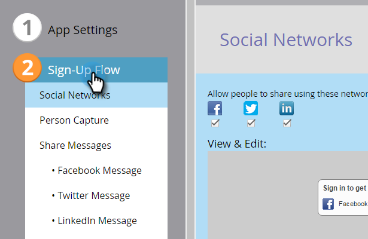

# Configura flusso di condivisione/registrazione social network {#configure-social-sign-up-share-flow}

Quando crei un’app social, puoi configurare le scelte del social network e i prompt che un utente incontra durante la registrazione.

## Seleziona reti da condividere {#select-networks-for-sharing}

1. Vai a **Attività di marketing**.

   

1. Seleziona l’app e fai clic su **Modifica bozza**.

   

1. Nell’editor dell’app social, fai clic su **Flusso registrazione** > **Social network**.

   

1. Selezionare (o deselezionare) le reti che un utente può condividere.

   

## Configurare il messaggio di Facebook {#configure-the-facebook-message}

1. Vai a **Flusso registrazione** > **Condividere messaggi**.

   

1. Configura il messaggio che verrà visualizzato nei post di Facebook.

   

   >[!NOTE]
   >
   >In una condivisione video, la miniatura viene generata automaticamente.

   Se si sceglie **Aggiungi contenuto dinamico**, i valori della pagina **OpenGraph** i tag (og:title, og:caption e og:description) e la miniatura vengono aggiunti automaticamente ai post di Facebook. Vedere il passaggio successivo.

   Se si sceglie **Aggiungi contenuto statico**, immetti il titolo, la didascalia, la descrizione e carica un&#39;immagine. Consulta i due passaggi successivi.

1. Nella finestra Visualizza e modifica, fai clic su **Mostra modifiche** e modificare il prompt di condivisione e il messaggio che verranno visualizzati nei post di Facebook.

   >[!TIP]
   >
   >Per ulteriori informazioni, consulta [Modifica impostazioni Facebook Rich Post](/help/marketo/product-docs/demand-generation/facebook/edit-facebook-rich-post-settings.md).

   

   >[!NOTE]
   >
   >Il [condividi URL](/help/marketo/product-docs/demand-generation/social/social-functions/choose-the-share-url-for-a-social-app.md) viene aggiunto automaticamente a tutti i messaggi di condivisione.

1. Se si sceglie **Aggiungi contenuto statico** sopra, modifica il titolo, la didascalia e la descrizione e carica un’immagine personalizzata (dal tuo [**Immagini e file Marketo**](/help/marketo/product-docs/demand-generation/images-and-files/add-images-and-files-to-marketo.md)).

   

   Consulta [Aggiungere immagini e file a Marketo](/help/marketo/product-docs/demand-generation/images-and-files/add-images-and-files-to-marketo.md).

   >[!NOTE]
   >
   >Se carichi un’immagine, non la visualizzerai qui finché non chiudi e riapri l’editor dell’app social.

1. Clic **Successivo**.

Se scegli i valori dei tag della pagina (og:title, og:caption e og:description) e la miniatura viene aggiunta automaticamente ai post di Facebook. Vedere il passaggio successivo.

## Configurare il messaggio di Twitter {#configure-the-twitter-message}

1. Modifica la richiesta di condivisione e il messaggio che verranno visualizzati nei tweet di Twitter.

   

   >[!TIP]
   >
   >Utilizzare {html_title} nel tweet per visualizzare automaticamente il titolo della pagina.

1. Clic **Successivo**.

## Configurare il messaggio di LinkedIn {#configure-the-linkedin-message}

1. Configura il messaggio che verrà visualizzato nei post di LinkedIn.

   

   Se si sceglie **Aggiungi contenuto dinamico**, i valori dei tag delle pagine (titolo e descrizione) e la miniatura vengono aggiunti automaticamente ai post di LinkedIn. Vedere il passaggio successivo.

   Se si sceglie **Aggiungi contenuto statico**, immetti il titolo, la didascalia e la descrizione, quindi carica un&#39;immagine. Consulta i due passaggi successivi.

1. In **Visualizza e modifica** finestra, fai clic su **Mostra modifiche** e modificare il prompt di condivisione e il messaggio che verranno visualizzati nei post di LinkedIn.

   

   >[!TIP]
   >
   >Utilizzare {html_title} nel post per visualizzare automaticamente il titolo della pagina.

1. Se si sceglie **Aggiungi contenuto statico** sopra, modifica il titolo e la descrizione e carica un’immagine personalizzata (dal tuo [**Immagini e file Marketo**](/help/marketo/product-docs/demand-generation/images-and-files/add-images-and-files-to-marketo.md)).

   

>[!NOTE]
>
>Se carichi un’immagine, non la visualizzerai qui finché non chiudi e riapri l’editor dell’app social.

>[!MORELIKETHIS]
>
>Quindi puoi fare clic su **Fine** > **Approva e chiudi** e inserisci la tua app social in una pagina di destinazione. Puoi anche configurare [acquisizione persona](/help/marketo/product-docs/demand-generation/social/configuring-social-actions/configure-person-capture-for-a-social-app.md) o [ricondividi prompt](/help/marketo/product-docs/demand-generation/social/configuring-social-actions/configure-re-share-email-and-prompt-for-a-social-app.md).
