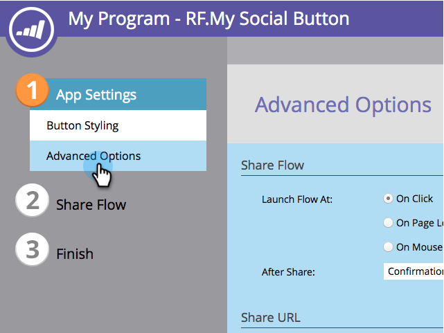

# Configura all&#39;apertura del pulsante Social {#configure-when-social-button-opens}

Quando crei una [pulsante social](/help/marketo/product-docs/demand-generation/landing-pages/free-form-landing-pages/add-a-social-button-to-a-free-form-landing-page.md), puoi configurare quando il pulsante presenta il prompt di condivisione.

1. Vai a **Attività di marketing**.

   

1. Seleziona l’app e fai clic su **Modifica bozza**.

   

1. Nell’editor di app social, vai a **Impostazioni app** > **Opzioni avanzate**.

   

1. Scegli quando il pulsante di condivisione presenta i prompt di condivisione.

   

   * **Al clic:** Quando una persona fa clic sul pulsante social.
   * **Al caricamento della pagina:** Non appena la pagina di destinazione che contiene il pulsante social viene caricata nel browser di una persona.
   * **Al passaggio del mouse:** Quando una persona passa il mouse sul pulsante social.

   >[!MORELIKETHIS]
   >
   >Dopo che la persona ha condiviso, puoi richiedere il suo indirizzo e-mail o presentare un messaggio di conferma. Scopri come [configurare i prompt dei comandi dopo la condivisione](/help/marketo/product-docs/demand-generation/social/configuring-social-actions/configure-after-share-prompts.md).
