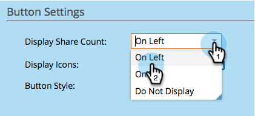
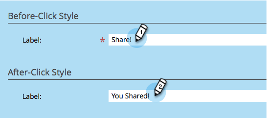

# Pulsante Personalizza app social {#customize-social-app-button}

Quando si crea un [pulsante social](/help/marketo/product-docs/demand-generation/landing-pages/free-form-landing-pages/add-a-social-button-to-a-free-form-landing-page.md) o un [offerta di riferimento](/help/marketo/product-docs/demand-generation/social/referral-offers/create-a-referral-offer.md), è possibile personalizzare l&#39;aspetto dei pulsanti.

1. Vai a **Attività di marketing**.

   

1. Seleziona l’app e fai clic su **Modifica bozza**.

   

1. Nell’editor delle app social, vai a **Impostazioni app** > **Stile pulsanti** (o **Stile registrazione,** per le offerte di riferimento).

   

1. Scegli dove visualizzare o meno il conteggio delle condivisioni.

   

1. Seleziona le icone dei social network da visualizzare con i pulsanti corrispondenti.

   

   >[!NOTE]
   >
   >Per le offerte di riferimento, seleziona le reti in **2. Flusso registrazione > Social network**.

1. Scegliere un tipo di pulsante.

   

   >[!TIP]
   >
   >Se si sceglie **Carica immagini in Stile pulsante** qui sopra, le sezioni seguenti ti consentono di caricare immagini di pulsanti invece di modificare il testo.

1. Modifica le etichette del pulsante prima e dopo aver fatto clic su.

   

1. Quando effettui ogni scelta, rivedi il risultato in **Visualizza e modifica** finestra.

   

>[!NOTE]
>
>In un’offerta di riferimento, puoi anche personalizzare **Tracciare l’avanzamento** pulsante. Vai a **Impostazioni app** > **Stile di avanzamento traccia** e segui gli stessi passaggi di cui sopra.

>[!MORELIKETHIS]
>
>Per un pulsante Social, [configura all’apertura](/help/marketo/product-docs/demand-generation/social/configuring-social-actions/configure-when-social-button-opens.md). Per un’offerta di riferimento, [specifica l’obiettivo dell’offerta](/help/marketo/product-docs/demand-generation/social/referral-offers/specify-goal-for-referral-offer.md).
