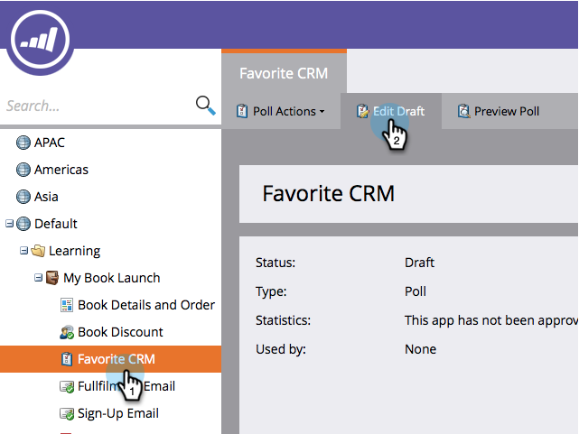

# Personalizza impostazioni sondaggio {#customize-poll-settings}

Quando [creare un sondaggio](/help/marketo/product-docs/demand-generation/social/creating-a-poll/create-a-poll.md), puoi limitare il numero di voti consentiti per profilo sociale.

1. Vai a **Attività di marketing**.

   

1. Seleziona il sondaggio e fai clic su **Modifica bozza**.

   

1. Nell’editor dei sondaggi, vai a **Impostazioni app** > **Opzioni avanzate**.

   

1. Seleziona l’opzione per imporre un **Limite di voto** e indicare il numero massimo di voti consentiti.

   

>[!TIP]
>
>Puoi fare clic su **Fine** > **Approva e chiudi** a [pubblicare il sondaggio](/help/marketo/product-docs/demand-generation/social/creating-a-poll/publish-a-poll.md)oppure puoi continuare a personalizzarlo. Ad esempio, prova [configurazione dei prompt di condivisione dopo](/help/marketo/product-docs/demand-generation/social/configuring-social-actions/configure-after-share-prompts.md).
