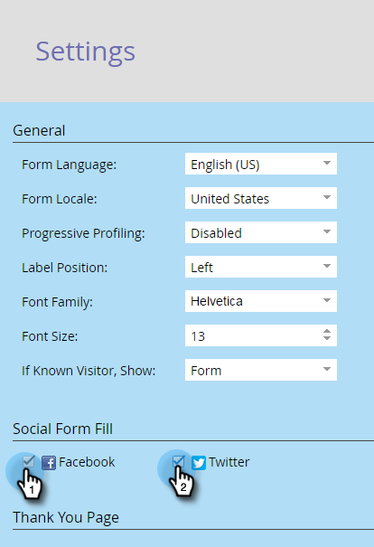

# Abilita compilazione modulo social network in un modulo (Social) {#enable-social-form-fill-on-a-form-social}

Consenti ai visitatori di compilare il modulo utilizzando il proprio social network. Ottieni automaticamente dati aggiuntivi e un’esperienza più rapida. Ecco come.

>[!AVAILABILITY]
>
>Questa funzionalità non è stata acquistata da tutti i clienti. Per ulteriori informazioni, contatta il tuo rappresentante commerciale.

1. Vai a **Attività di marketing**.

   

1. Seleziona il modulo e fai clic su **Modifica modulo**.

   

1. In Impostazioni modulo, fai clic su **Impostazioni**.

   

1. Selezionare i pulsanti del social network che si desidera includere.

   

   >[!TIP]
   >
   >Dai un&#39;occhiata [dati che Marketo acquisirà](/help/marketo/product-docs/demand-generation/social/social-functions/manage-social-profile-data.md) se gli utenti utilizzano i pulsanti social.

1. Clic **Fine**.

   

1. Clic **Approva e chiudi**.

   

   Eccolo.

   

Fantastico, eh?
